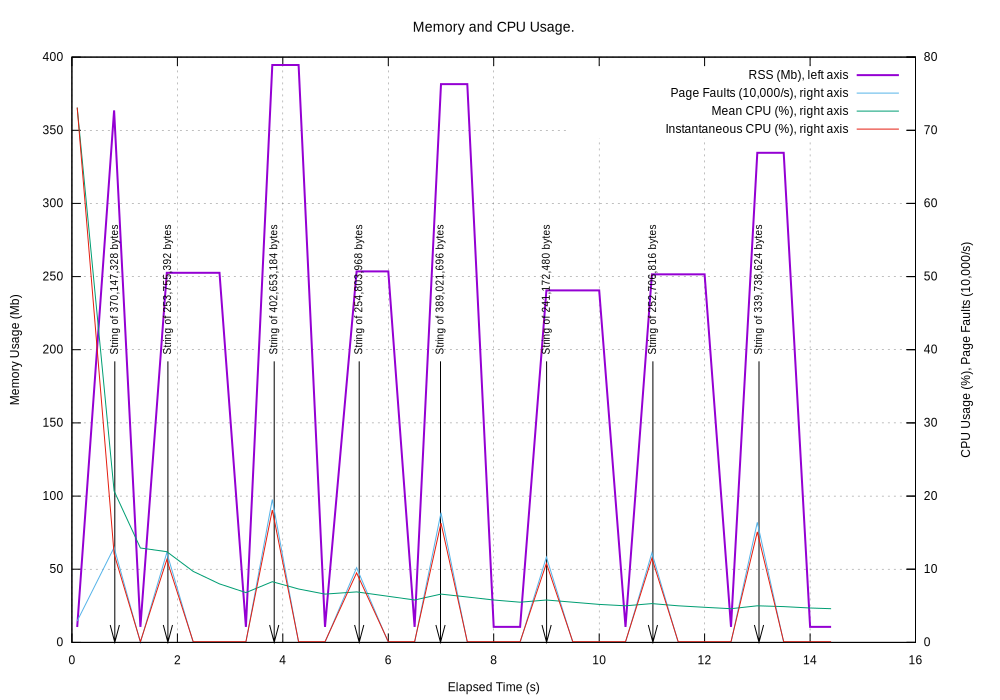

.. _examples-process:

``process`` Examples
==============================

``process`` is a very lightweight way of logging the total memory usage at regular time intervals.
Here is an example:

.. code-block:: python

    import logging
    import random
    import sys
    import time

    from pymemtrace import process

    logger = logging.getLogger(__file__)

    def main() -> int:
        logging.basicConfig(
            level=logging.INFO,
            format='%(asctime)s - %(filename)s#%(lineno)d - %(process)5d - (%(threadName)-10s) - %(levelname)-8s - %(message)s',
        )
        logger.info('Demonstration of logging a process')
        # Log process data to the log file every 0.5 seconds.
        with process.log_process(interval=0.5, log_level=logger.getEffectiveLevel()):
            for i in range(8):
                size = random.randint(128, 128 + 256) * 1024 ** 2
                # Add a message to report in the next process write.
                process.add_message_to_queue(f'String of {size:,d} bytes')
                s = ' ' * size
                time.sleep(0.75 + random.random())
                del s
                time.sleep(0.25 + random.random() / 2)
        return 0

    if __name__ == '__main__':
        sys.exit(main())

The output will be something like:

.. code-block:: text

    $ python pymemtrace/examples/ex_process.py
    2020-11-16 10:36:38,886 - ex_process.py#19 - 14052 - (MainThread) - INFO     - Demonstration of logging a process
    2020-11-16 10:36:38,887 - process.py#289 - 14052 - (ProcMon   ) - INFO     - ProcessLoggingThread-JSON-START {"timestamp": "2020-11-16 10:36:38.887407", "memory_info": {"rss": 11403264, "vms": 4376133632, "pfaults": 3417, "pageins": 0}, "cpu_times": {"user": 0.07780156, "system": 0.01763538, "children_user": 0.0, "children_system": 0.0}, "elapsed_time": 0.09744381904602051, "pid": 14052}
    2020-11-16 10:36:39,392 - process.py#293 - 14052 - (ProcMon   ) - INFO     - ProcessLoggingThread-JSON {"timestamp": "2020-11-16 10:36:39.392076", "memory_info": {"rss": 209616896, "vms": 4574580736, "pfaults": 51809, "pageins": 0}, "cpu_times": {"user": 0.123138272, "system": 0.080602592, "children_user": 0.0, "children_system": 0.0}, "elapsed_time": 0.6022598743438721, "pid": 14052, "label": "String of 198,180,864 bytes"}
    2020-11-16 10:36:39,892 - process.py#289 - 14052 - (ProcMon   ) - INFO     - ProcessLoggingThread-JSON {"timestamp": "2020-11-16 10:36:39.892747", "memory_info": {"rss": 209620992, "vms": 4574580736, "pfaults": 51810, "pageins": 0}, "cpu_times": {"user": 0.123503456, "system": 0.080648712, "children_user": 0.0, "children_system": 0.0}, "elapsed_time": 1.1028308868408203, "pid": 14052}
    2020-11-16 10:36:40,397 - process.py#289 - 14052 - (ProcMon   ) - INFO     - ProcessLoggingThread-JSON {"timestamp": "2020-11-16 10:36:40.397231", "memory_info": {"rss": 11440128, "vms": 4376395776, "pfaults": 51811, "pageins": 0}, "cpu_times": {"user": 0.123984048, "system": 0.10224284, "children_user": 0.0, "children_system": 0.0}, "elapsed_time": 1.6074140071868896, "pid": 14052}
    2020-11-16 10:36:40,901 - process.py#293 - 14052 - (ProcMon   ) - INFO     - ProcessLoggingThread-JSON {"timestamp": "2020-11-16 10:36:40.901329", "memory_info": {"rss": 320774144, "vms": 4685729792, "pfaults": 127332, "pageins": 0}, "cpu_times": {"user": 0.194056, "system": 0.191915568, "children_user": 0.0, "children_system": 0.0}, "elapsed_time": 2.1114120483398438, "pid": 14052, "label": "String of 309,329,920 bytes"}
    ...

Note the additions of ``"label": "String of 198,180,864 bytes"`` in two places.

The line:

.. code-block:: python

    with process.log_process(interval=0.5, log_level=logger.getEffectiveLevel()):
        # As before.

Instructs ``process`` to report every 0.5 seconds to the current log at the current log level.
You can specify an actual log level so:

.. code-block:: python

    with process.log_process(interval=0.5, logging.INFO):
        # As before.

And that will suppress any ``process`` output if you have teh logging level set at, say, ERROR.

Monitoring Another Process
-----------------------------------

``process`` can monitor another process from the command line:

.. code-block:: bash

    $ python pymemtrace/process.py -p 71519
    2020-11-10 20:46:41,687 - process.py#354 - 71869 - (MainThread) - INFO     - Demonstration of logging a process
    Monitoring 71519
    2020-11-10 20:46:41,689 - process.py#289 - 71869 - (ProcMon   ) - INFO     - ProcessLoggingThread-JSON-START {"timestamp": "2020-11-10 20:46:41.688480", "memory_info": {"rss": 12906496, "vms": 4359774208, "pfaults": 3310, "pageins": 960}, "cpu_times": {"user": 0.248923952, "system": 0.078601624, "children_user": 0.0, "children_system": 0.0}, "elapsed_time": 1396.3783469200134, "pid": 71519}
    2020-11-10 20:46:42,693 - process.py#289 - 71869 - (ProcMon   ) - INFO     - ProcessLoggingThread-JSON {"timestamp": "2020-11-10 20:46:42.693520", "memory_info": {"rss": 12906496, "vms": 4359774208, "pfaults": 3310, "pageins": 960}, "cpu_times": {"user": 0.248923952, "system": 0.078601624, "children_user": 0.0, "children_system": 0.0}, "elapsed_time": 1397.3834369182587, "pid": 71519}
    2020-11-10 20:46:43,697 - process.py#289 - 71869 - (ProcMon   ) - INFO     - ProcessLoggingThread-JSON {"timestamp": "2020-11-10 20:46:43.697247", "memory_info": {"rss": 12906496, "vms": 4359774208, "pfaults": 3310, "pageins": 960}, "cpu_times": {"user": 0.248923952, "system": 0.078601624, "children_user": 0.0, "children_system": 0.0}, "elapsed_time": 1398.3871541023254, "pid": 71519}
    2020-11-10 20:46:44,701 - process.py#289 - 71869 - (ProcMon   ) - INFO     - ProcessLoggingThread-JSON {"timestamp": "2020-11-10 20:46:44.701290", "memory_info": {"rss": 12906496, "vms": 4359774208, "pfaults": 3310, "pageins": 960}, "cpu_times": {"user": 0.248923952, "system": 0.078601624, "children_user": 0.0, "children_system": 0.0}, "elapsed_time": 1399.391231060028, "pid": 71519}
    2020-11-10 20:46:45,705 - process.py#289 - 71869 - (ProcMon   ) - INFO     - ProcessLoggingThread-JSON {"timestamp": "2020-11-10 20:46:45.705679", "memory_info": {"rss": 12906496, "vms": 4359774208, "pfaults": 3310, "pageins": 960}, "cpu_times": {"user": 0.248923952, "system": 0.078601624, "children_user": 0.0, "children_system": 0.0}, "elapsed_time": 1400.3956229686737, "pid": 71519}
    2020-11-10 20:46:46,708 - process.py#289 - 71869 - (ProcMon   ) - INFO     - ProcessLoggingThread-JSON {"timestamp": "2020-11-10 20:46:46.708657", "memory_info": {"rss": 12906496, "vms": 4359774208, "pfaults": 3310, "pageins": 960}, "cpu_times": {"user": 0.248923952, "system": 0.078601624, "children_user": 0.0, "children_system": 0.0}, "elapsed_time": 1401.398586988449, "pid": 71519}
    ^CKeyboardInterrupt!
    2020-11-10 20:46:47,626 - process.py#289 - 71869 - (MainThread) - INFO     - ProcessLoggingThread-JSON-STOP {"timestamp": "2020-11-10 20:46:47.626020", "memory_info": {"rss": 12906496, "vms": 4359774208, "pfaults": 3310, "pageins": 960}, "cpu_times": {"user": 0.248923952, "system": 0.078601624, "children_user": 0.0, "children_system": 0.0}, "elapsed_time": 1402.3160009384155, "pid": 71519}
    Bye, bye!

Using ``gnuplot`` on the Log File
--------------------------------------

``process`` can extract memory data from the log file and write the necessary files for plotting with ``gnuplot`` (which must be installed).

.. code-block:: bash

    $ pwd
    ~/Documents/workspace/pymemtrace (master)
    $ mkdir tmp
    $ mkdir tmp/gnuplot
    $ python pymemtrace/examples/ex_process.py > tmp/process.log 2>&1
    $ python pymemtrace/process.py tmp/process.log tmp/gnuplot/
    2020-11-16 10:39:55,884 - gnuplot.py#114 - 14141 - (MainThread) - INFO     - gnuplot stdout: None
    2020-11-16 10:39:55,887 - gnuplot.py#67 - 14141 - (MainThread) - INFO     - Writing gnuplot data "process.log_14129" in path tmp/gnuplot/
    2020-11-16 10:39:55,924 - gnuplot.py#85 - 14141 - (MainThread) - INFO     - gnuplot stdout: None
    Bye, bye!
    $ ll tmp/gnuplot/
    total 160
    -rw-r--r--  1 user  staff   4829 16 Nov 10:39 process.log_14129.dat
    -rw-r--r--  1 user  staff   2766 16 Nov 10:39 process.log_14129.plt
    -rw-r--r--  1 user  staff  32943 16 Nov 10:39 process.log_14129.svg
    -rw-r--r--  1 user  staff  32100 16 Nov 10:39 test.svg

The file ``process.log_14129.svg`` will look like this:

