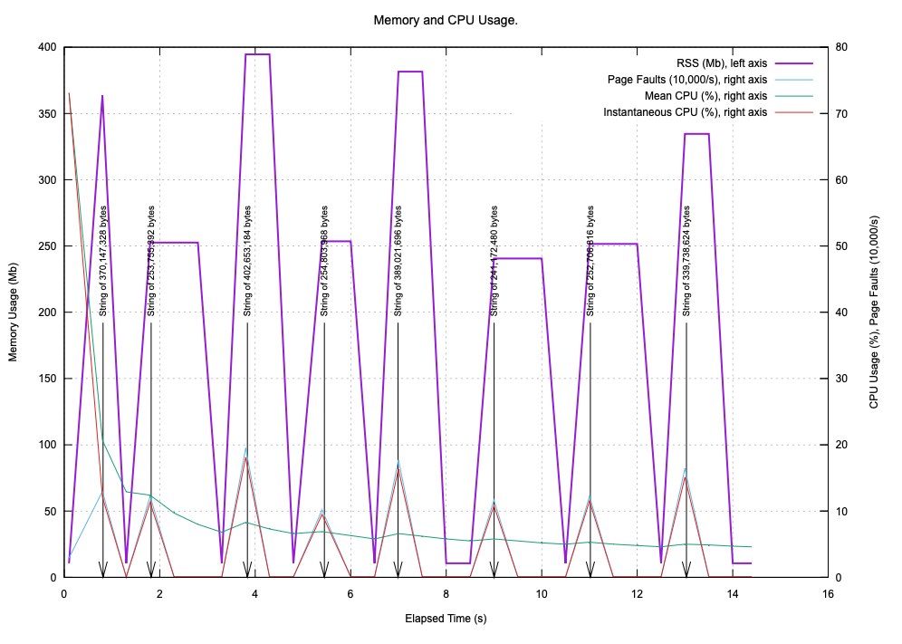

.. raw:: latex

    \pagebreak

.. _examples-process:

``process`` Examples
==============================

:py:mod:`pymemtrace.process` is a very lightweight way of logging the total memory usage at regular time intervals.
It creates a monitoring thread that writes process information as JSON to your log output.

Monitoring Your Python Process
-----------------------------------

Here is an example of including :py:mod:`pymemtrace.process` in your Python code:

.. code-block:: python

    import logging
    import random
    import sys
    import time

    from pymemtrace import process

    logger = logging.getLogger(__file__)

    def main() -> int:
        logging.basicConfig(
            level=logging.INFO,
            format=(
                '%(asctime)s - %(filename)s#%(lineno)d - %(process)5d
                ' - (%(threadName)-10s) - %(levelname)-8s - %(message)s'
                ),
        )
        logger.info('Demonstration of logging a process')
        # Log process data to the log file every 0.5 seconds.
        with process.log_process(interval=0.5, log_level=logger.getEffectiveLevel()):
            for i in range(8):
                size = random.randint(128, 128 + 256) * 1024 ** 2
                # Add a message to report in the next process write.
                process.add_message_to_queue(f'String of {size:,d} bytes')
                s = ' ' * size
                time.sleep(0.75 + random.random())
                del s
                time.sleep(0.25 + random.random() / 2)
        return 0

    if __name__ == '__main__':
        sys.exit(main())

The output will be something like:

.. raw:: latex

    [Continued on the next page]

    \pagebreak

.. raw:: latex

    \begin{landscape}

.. code-block:: text

    $ python pymemtrace/examples/ex_process.py
    2020-11-16 10:36:38,886 - ex_process.py#19 - 14052 - (MainThread) - INFO     - Demonstration of logging a process
    2020-11-16 10:36:38,887 - process.py#289 - 14052 - (ProcMon   ) - INFO     - ProcessLoggingThread-JSON-START {"timestamp": "2020-11-16 10:36:38.887407", "memory_info": {"rss": 11403264, "vms": 4376133632, "pfaults": 3417, "pageins": 0}, "cpu_times": {"user": 0.07780156, "system": 0.01763538, "children_user": 0.0, "children_system": 0.0}, "elapsed_time": 0.09744381904602051, "pid": 14052}
    2020-11-16 10:36:39,392 - process.py#293 - 14052 - (ProcMon   ) - INFO     - ProcessLoggingThread-JSON {"timestamp": "2020-11-16 10:36:39.392076", "memory_info": {"rss": 209616896, "vms": 4574580736, "pfaults": 51809, "pageins": 0}, "cpu_times": {"user": 0.123138272, "system": 0.080602592, "children_user": 0.0, "children_system": 0.0}, "elapsed_time": 0.6022598743438721, "pid": 14052, "label": "String of 198,180,864 bytes"}
    2020-11-16 10:36:39,892 - process.py#289 - 14052 - (ProcMon   ) - INFO     - ProcessLoggingThread-JSON {"timestamp": "2020-11-16 10:36:39.892747", "memory_info": {"rss": 209620992, "vms": 4574580736, "pfaults": 51810, "pageins": 0}, "cpu_times": {"user": 0.123503456, "system": 0.080648712, "children_user": 0.0, "children_system": 0.0}, "elapsed_time": 1.1028308868408203, "pid": 14052}
    2020-11-16 10:36:40,397 - process.py#289 - 14052 - (ProcMon   ) - INFO     - ProcessLoggingThread-JSON {"timestamp": "2020-11-16 10:36:40.397231", "memory_info": {"rss": 11440128, "vms": 4376395776, "pfaults": 51811, "pageins": 0}, "cpu_times": {"user": 0.123984048, "system": 0.10224284, "children_user": 0.0, "children_system": 0.0}, "elapsed_time": 1.6074140071868896, "pid": 14052}
    2020-11-16 10:36:40,901 - process.py#293 - 14052 - (ProcMon   ) - INFO     - ProcessLoggingThread-JSON {"timestamp": "2020-11-16 10:36:40.901329", "memory_info": {"rss": 320774144, "vms": 4685729792, "pfaults": 127332, "pageins": 0}, "cpu_times": {"user": 0.194056, "system": 0.191915568, "children_user": 0.0, "children_system": 0.0}, "elapsed_time": 2.1114120483398438, "pid": 14052, "label": "String of 309,329,920 bytes"}
    ...

.. raw:: latex

    \end{landscape}

Note the additions of ``"label": "String of 198,180,864 bytes"`` in two places.

JSON Data
---------

The JSON data embedded in the log file line is typically:

.. code-block:: json

    {
        "cpu_times": {
            "children_system": 0.0,
            "children_user": 0.0,
            "system": 3.594337536,
            "user": 7.388873216
        },
        "elapsed_time": 68.32946181297302,
        "label": "String of 238.000 MB",
        "memory_info": {
            "pageins": 573,
            "pfaults": 518963,
            "rss": 41639936,
            "vms": 35048869888
        },
        "pid": 89781,
        "timestamp": "2026-03-23 11:49:18.406656"
    }

Log Level and Frequency
-----------------------

The line:

.. code-block:: python

    with process.log_process(interval=0.5, log_level=logger.getEffectiveLevel()):
        # As before.

Instructs :py:mod:`pymemtrace.process` to report every 0.5 seconds to the current log at the current log level.
You can specify an actual log level so:

.. code-block:: python

    with process.log_process(interval=0.5, logging.INFO):
        # As before.

And that will suppress any :py:mod:`pymemtrace.process` output if you have the logging level set at, in this example,
INFO.

Using ``process`` as a Decorator
-----------------------------------

Sometimes it is useful to (temporarily) monitor a particular function for debugging purposes.
:py:mod:`pymemtrace.process` provides a decorator :py:meth:`pymemtrace.process.log_process_dec` for this purpose.
Here is an example, first the imports and preamble:

.. code-block:: python

    import logging
    import random
    import sys
    import time

    from pymemtrace import process

    logger = logging.getLogger(__file__)

Here is a function that just creates a list of large, randomly sized strings.
It is decorated with :py:meth:`pymemtrace.process.log_process_dec` to report to the log every 0.5 seconds:

.. code-block:: python

    @process.log_process_dec(interval=0.5, log_level=logger.getEffectiveLevel())
    def example_process_decorator_basic():
        # create_list_of_strings...
        l = []
        for i in range(4):
            l.append(' ' * random.randint(20 * 1024 ** 2, 50 * 1024 ** 2))
            time.sleep(0.5)
        while len(l):
            l.pop()
            time.sleep(0.5)

Adding a ``main()`` calling function:

.. code-block:: python

    def main() -> int:
        logging.basicConfig(
            level=logging.INFO,
            format=(
                '%(asctime)s - %(filename)s#%(lineno)d - %(process)5d
                ' - (%(threadName)-10s) - %(levelname)-8s - %(message)s'
            ),
            stream=sys.stdout,
        )
        logger.info('Demonstration of logging a process')
        example_process_decorator_basic()
        return 0

    if __name__ == '__main__':
        sys.exit(main())

Running this gives this, for example:

.. raw:: latex

    [Continued on the next page]

    \pagebreak

.. raw:: latex

    \begin{landscape}

.. code-block:: text

    $ python3.13 pymemtrace/examples/ex_process_decorator.py
    2026-03-21 12:39:35,034 - ex_process_decorator.py#37 - 82965 - (MainThread) - INFO     - Demonstration of logging a process
    2026-03-21 12:39:35,035 - process.py#288 - 82965 - (ProcMon   ) - WARNING  - ProcessLoggingThread-JSON-START {"timestamp": "2026-03-21 12:39:35.035089", "memory_info": {"rss": 22712320, "vms": 34986401792, "pfaults": 6566, "pageins": 146}, "cpu_times": {"user": 1.062269568, "system": 1.0507504, "children_user": 0.0, "children_system": 0.0}, "elapsed_time": 2.547363042831421, "pid": 82965}
    2026-03-21 12:39:35,536 - process.py#288 - 82965 - (ProcMon   ) - WARNING  - ProcessLoggingThread-JSON {"timestamp": "2026-03-21 12:39:35.535948", "memory_info": {"rss": 46358528, "vms": 35010007040, "pfaults": 12339, "pageins": 154}, "cpu_times": {"user": 1.087670144, "system": 1.05609504, "children_user": 0.0, "children_system": 0.0}, "elapsed_time": 3.048292875289917, "pid": 82965}
    2026-03-21 12:39:36,038 - process.py#288 - 82965 - (ProcMon   ) - WARNING  - ProcessLoggingThread-JSON {"timestamp": "2026-03-21 12:39:36.037811", "memory_info": {"rss": 86491136, "vms": 35050139648, "pfaults": 22137, "pageins": 154}, "cpu_times": {"user": 1.134148608, "system": 1.069060928, "children_user": 0.0, "children_system": 0.0}, "elapsed_time": 3.5501270294189453, "pid": 82965}
    2026-03-21 12:39:36,543 - process.py#288 - 82965 - (ProcMon   ) - WARNING  - ProcessLoggingThread-JSON {"timestamp": "2026-03-21 12:39:36.543283", "memory_info": {"rss": 126611456, "vms": 35090259968, "pfaults": 31933, "pageins": 154}, "cpu_times": {"user": 1.18200256, "system": 1.081039616, "children_user": 0.0, "children_system": 0.0}, "elapsed_time": 4.0557920932769775, "pid": 82965}
    2026-03-21 12:39:37,048 - process.py#288 - 82965 - (ProcMon   ) - WARNING  - ProcessLoggingThread-JSON {"timestamp": "2026-03-21 12:39:37.047784", "memory_info": {"rss": 160964608, "vms": 35124613120, "pfaults": 40320, "pageins": 154}, "cpu_times": {"user": 1.225273984, "system": 1.091218048, "children_user": 0.0, "children_system": 0.0}, "elapsed_time": 4.5602850914001465, "pid": 82965}
    2026-03-21 12:39:37,549 - process.py#288 - 82965 - (ProcMon   ) - WARNING  - ProcessLoggingThread-JSON {"timestamp": "2026-03-21 12:39:37.548690", "memory_info": {"rss": 160964608, "vms": 35124613120, "pfaults": 40320, "pageins": 154}, "cpu_times": {"user": 1.230032896, "system": 1.095199872, "children_user": 0.0, "children_system": 0.0}, "elapsed_time": 5.061201095581055, "pid": 82965}
    2026-03-21 12:39:38,052 - process.py#288 - 82965 - (ProcMon   ) - WARNING  - ProcessLoggingThread-JSON {"timestamp": "2026-03-21 12:39:38.052779", "memory_info": {"rss": 160968704, "vms": 35124613120, "pfaults": 40321, "pageins": 154}, "cpu_times": {"user": 1.234988032, "system": 1.099866752, "children_user": 0.0, "children_system": 0.0}, "elapsed_time": 5.565093040466309, "pid": 82965}
    2026-03-21 12:39:38,557 - process.py#288 - 82965 - (ProcMon   ) - WARNING  - ProcessLoggingThread-JSON {"timestamp": "2026-03-21 12:39:38.557330", "memory_info": {"rss": 160968704, "vms": 35124613120, "pfaults": 40322, "pageins": 154}, "cpu_times": {"user": 1.241057152, "system": 1.104048384, "children_user": 0.0, "children_system": 0.0}, "elapsed_time": 6.069844007492065, "pid": 82965}
    2026-03-21 12:39:39,062 - process.py#288 - 82965 - (ProcMon   ) - WARNING  - ProcessLoggingThread-JSON {"timestamp": "2026-03-21 12:39:39.061620", "memory_info": {"rss": 160968704, "vms": 35124613120, "pfaults": 40322, "pageins": 154}, "cpu_times": {"user": 1.245515776, "system": 1.10786624, "children_user": 0.0, "children_system": 0.0}, "elapsed_time": 6.574124813079834, "pid": 82965}
    2026-03-21 12:39:39,286 - process.py#288 - 82965 - (MainThread) - WARNING  - ProcessLoggingThread-JSON-STOP {"timestamp": "2026-03-21 12:39:39.286393", "memory_info": {"rss": 160972800, "vms": 35124613120, "pfaults": 40323, "pageins": 154}, "cpu_times": {"user": 1.246212992, "system": 1.10794368, "children_user": 0.0, "children_system": 0.0}, "elapsed_time": 6.798800945281982, "pid": 82965}

    Process finished with exit code 0

.. raw:: latex

    \end{landscape}

Thst is a lot to swallow so see :ref:`examples-process_summarising_the_log_file` below which simplifies the output
to the essential details.

See ``pymemtrace/examples/ex_process_decorator.py`` for this example.

Monitoring Another Process
-----------------------------------

:py:mod:`pymemtrace.process` can monitor any another process from the command line by giving it the PID:

.. raw:: latex

    [Continued on the next page]

    \pagebreak

.. raw:: latex

    \begin{landscape}

.. code-block:: bash

    $ python pymemtrace/process.py -p 71519
    2020-11-10 20:46:41,687 - process.py#354 - 71869 - (MainThread) - INFO     - Demonstration of logging a process
    Monitoring 71519
    2020-11-10 20:46:41,689 - process.py#289 - 71869 - (ProcMon   ) - INFO     - ProcessLoggingThread-JSON-START {"timestamp": "2020-11-10 20:46:41.688480", "memory_info": {"rss": 12906496, "vms": 4359774208, "pfaults": 3310, "pageins": 960}, "cpu_times": {"user": 0.248923952, "system": 0.078601624, "children_user": 0.0, "children_system": 0.0}, "elapsed_time": 1396.3783469200134, "pid": 71519}
    2020-11-10 20:46:42,693 - process.py#289 - 71869 - (ProcMon   ) - INFO     - ProcessLoggingThread-JSON {"timestamp": "2020-11-10 20:46:42.693520", "memory_info": {"rss": 12906496, "vms": 4359774208, "pfaults": 3310, "pageins": 960}, "cpu_times": {"user": 0.248923952, "system": 0.078601624, "children_user": 0.0, "children_system": 0.0}, "elapsed_time": 1397.3834369182587, "pid": 71519}
    2020-11-10 20:46:43,697 - process.py#289 - 71869 - (ProcMon   ) - INFO     - ProcessLoggingThread-JSON {"timestamp": "2020-11-10 20:46:43.697247", "memory_info": {"rss": 12906496, "vms": 4359774208, "pfaults": 3310, "pageins": 960}, "cpu_times": {"user": 0.248923952, "system": 0.078601624, "children_user": 0.0, "children_system": 0.0}, "elapsed_time": 1398.3871541023254, "pid": 71519}
    2020-11-10 20:46:44,701 - process.py#289 - 71869 - (ProcMon   ) - INFO     - ProcessLoggingThread-JSON {"timestamp": "2020-11-10 20:46:44.701290", "memory_info": {"rss": 12906496, "vms": 4359774208, "pfaults": 3310, "pageins": 960}, "cpu_times": {"user": 0.248923952, "system": 0.078601624, "children_user": 0.0, "children_system": 0.0}, "elapsed_time": 1399.391231060028, "pid": 71519}
    2020-11-10 20:46:45,705 - process.py#289 - 71869 - (ProcMon   ) - INFO     - ProcessLoggingThread-JSON {"timestamp": "2020-11-10 20:46:45.705679", "memory_info": {"rss": 12906496, "vms": 4359774208, "pfaults": 3310, "pageins": 960}, "cpu_times": {"user": 0.248923952, "system": 0.078601624, "children_user": 0.0, "children_system": 0.0}, "elapsed_time": 1400.3956229686737, "pid": 71519}
    2020-11-10 20:46:46,708 - process.py#289 - 71869 - (ProcMon   ) - INFO     - ProcessLoggingThread-JSON {"timestamp": "2020-11-10 20:46:46.708657", "memory_info": {"rss": 12906496, "vms": 4359774208, "pfaults": 3310, "pageins": 960}, "cpu_times": {"user": 0.248923952, "system": 0.078601624, "children_user": 0.0, "children_system": 0.0}, "elapsed_time": 1401.398586988449, "pid": 71519}
    ^CKeyboardInterrupt!
    2020-11-10 20:46:47,626 - process.py#289 - 71869 - (MainThread) - INFO     - ProcessLoggingThread-JSON-STOP {"timestamp": "2020-11-10 20:46:47.626020", "memory_info": {"rss": 12906496, "vms": 4359774208, "pfaults": 3310, "pageins": 960}, "cpu_times": {"user": 0.248923952, "system": 0.078601624, "children_user": 0.0, "children_system": 0.0}, "elapsed_time": 1402.3160009384155, "pid": 71519}
    Bye, bye!

.. raw:: latex

    \end{landscape}

.. _examples-process_summarising_the_log_file:

Summarising the Log File
--------------------------------------

:py:mod:`pymemtrace.process` can read a captured log file and summarise it.

Taking the decorator example above we can pipe the log to a file:

.. code-block:: shell

    $ python pymemtrace/examples/ex_process_decorator.py > tmp/ex_process_decorator.py.txt

Then we can analyse the saved log file:

.. code-block:: shell

    $ python pymemtrace/process.py tmp/ex_process_decorator.py.txt

.. raw:: latex

    [Continued on the next page]

    \pagebreak

.. raw:: latex

    \begin{landscape}

.. code-block:: shell

    -------------------------------- PID: 83606 -------------------------------
    #t(s)                 RSS PageFaults/s         User    Mean_CPU%    Inst_CPU% Timestamp                     PID Label
    0.4              18477056      12104.2          0.2        38.1%        38.1% 2026-03-21T13:07:51.567924  83606 #
    0.9              51056640      15748.4          0.2        22.0%         8.8% 2026-03-21T13:07:52.071953  83606 #
    1.4              85819392      16833.1          0.3        18.5%        12.2% 2026-03-21T13:07:52.576988  83606 #
    1.9             125403136      19279.2          0.3        16.2%         9.5% 2026-03-21T13:07:53.078218  83606 #
    2.4             159227904      16374.3          0.4        14.7%         9.2% 2026-03-21T13:07:53.582512  83606 #
    2.9             159227904          0.0          0.4        12.3%         0.9% 2026-03-21T13:07:54.086849  83606 #
    3.4             159227904          0.0          0.4        11.0%         3.4% 2026-03-21T13:07:54.590127  83606 #
    3.9             159227904          0.0          0.4         9.7%         0.5% 2026-03-21T13:07:55.091277  83606 #
    4.4             159227904          0.0          0.4         8.7%         1.0% 2026-03-21T13:07:55.596389  83606 #
    4.7             159227904          0.0          0.4         8.2%         0.3% 2026-03-21T13:07:55.884672  83606 #
    ----------------------------- PID: 83606 DONE -----------------------------
    Bye, bye!

.. raw:: latex

    \end{landscape}

Using ``gnuplot`` on the Log File
--------------------------------------

:py:mod:`pymemtrace.process` can extract memory data from the log file and write the necessary files for
plotting with ``gnuplot`` (which must be installed).

For example run a process and save the log output:

.. code-block:: bash

    $ mkdir tmp
    $ python pymemtrace/examples/ex_process.py > tmp/process.log 2>&1

Now run :py:mod:`pymemtrace.process` with that log file and an output location:

.. code-block:: bash

    $ mkdir tmp/gnuplot
    $ python pymemtrace/process.py tmp/process.log tmp/gnuplot/
    2020-11-16 10:39:55,884 - gnuplot.py#114 - 14141 - (MainThread) - INFO     - gnuplot stdout: None
    2020-11-16 10:39:55,887 - gnuplot.py#67 - 14141 - (MainThread) - INFO     - Writing gnuplot data "process.log_14129" in path tmp/gnuplot/
    2020-11-16 10:39:55,924 - gnuplot.py#85 - 14141 - (MainThread) - INFO     - gnuplot stdout: None
    Bye, bye!

In the destination will be the ``gnuplot`` data:

.. code-block:: bash

    $ ll tmp/gnuplot/
    total 160
    -rw-r--r--  1 user  staff   4829 16 Nov 10:39 process.log_14129.dat
    -rw-r--r--  1 user  staff   2766 16 Nov 10:39 process.log_14129.plt
    -rw-r--r--  1 user  staff  32943 16 Nov 10:39 process.log_14129.png
    -rw-r--r--  1 user  staff  32100 16 Nov 10:39 test.png

The file ``process.log_14129.png`` will look like this.
The memory, page faults and CPU usage and the plot is annotated with the lables made by the
line ``process.add_message_to_queue(f'String of {size:,d} bytes')`` in the script above:

