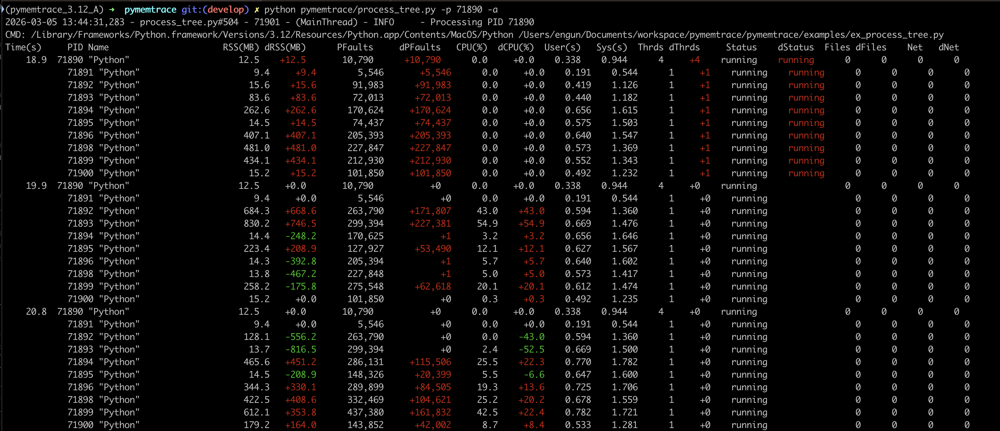
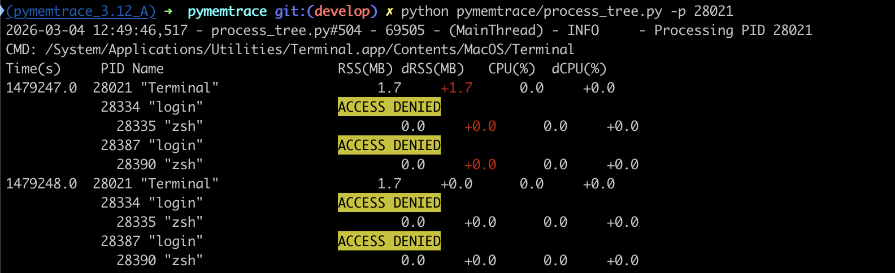
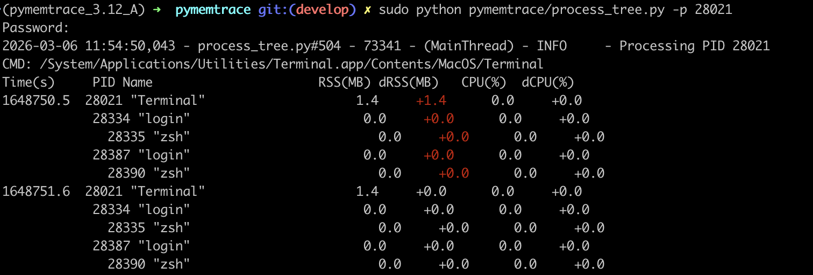

.. _examples-process_tree:

``process_tree`` Examples
==============================

``process_tree`` is a very lightweight way of recording the total memory usage at regular time intervals and reporting
the progress of a process *and* all its children.

Example Target
------------------

Here is a code example simplified from ``pymemtrace/examples/ex_process_tree.py`` which spawns several processes each of
which repeatedly creates and destroys large strings:

.. code-block:: python

    import random
    import time
    import multiprocessing

    def sub_process(task_id: int) -> int:
        ret = 0
        for alloc in range(8):
            str_len = random.randint(128 * 1024**2, 1024**3)
            string = ' ' * str_len
            ret += len(string)
            time.sleep(0.75 + random.random())
            del string
            time.sleep(0.25 + random.random())
        return ret

    def run_processes():
        with multiprocessing.Pool(processes=8) as pool:
            result = [
                r.get()[0] for r in [
                    pool.map_async(sub_process, [t, ]) for t in range(8)
                ]
            ]

    if __name__ == '__main__':
        run_processes()

Run this and then run ``process_tree.py`` on that PID.
By default ``process_tree.py`` will just log the RSS and CPU but in this case we are using ``-a`` to output all the
measurements.
The output is colourised showing red as an increasing value and green as a decreasing value
[continued on the next page]:

.. raw:: latex

    \pagebreak

.. raw:: latex

    \begin{landscape}

.. raw:: latex

    \end{landscape}

Command Line Options
----------------------

``process_tree.py`` has a large number of options.

General Options
^^^^^^^^^^^^^^^^^^^^^^

.. list-table:: **General Options**
   :widths: 45 55
   :header-rows: 1

   * - Option
     - Description.
   * - ``-h, --help``
     - Show this help message and exit.
   * - ``-i INTERVAL, --interval INTERVAL``
     - Logging interval in seconds [default: 1.0]
   * - ``-p PID, --pid PID``
     - The PID to monitor, -1 it is this process [default: -1]
   * - ``-l LOG_LEVEL, --log_level LOG_LEVEL``
     - Log Level (debug=10, info=20, warning=30, error=40, critical=50) [default: 20]

Options That Control the Output
^^^^^^^^^^^^^^^^^^^^^^^^^^^^^^^^

Other options control the output of ``process_tree.py``:

.. list-table:: **Output Options**
   :widths: 30 70
   :header-rows: 1

   * - Option
     - Description.
   * - ``--sep SEP``
     - String to use as seperator such as "|". Default is to format as a table [default: ""]

   * - ``-1, --omit-first``
     - Omit the first sample. This makes the diffs a bit cleaner [default: Fals]e
   * - ``-u, --uss``
     - The USS, this is the amount of memory that would be freed if the process was terminated right now [default: False]
   * - ``-g, --page-faults``
     - Number of page faults [default: False]
   * - ``-c, --cpu-times``
     - User and system time [default: False]
   * - ``-x, --context-switches``
     - Show number of contest switches [default: False]
   * - ``-t, --threads``
     - Show number of threads [default: False]
   * - ``-s, --status``
     - Show the status [default: False]
   * - ``-f, --open-files``
     - Show the number of open files [default: False]
   * - ``-n, --net-connections``
     - Show the number of network connections [default: False]
   * - ``--cmdline``
     - Show the command line for each process (verbose) [default: False]
   * - ``-a, --all``
     - Show typical data, equivalent to ``-cfgstn`` [default: False]
   * - ``--json JSON``
     - Path to a JSON file to also write the data to. [default: ""]

Access Denied
------------------

If you do not have access rights to the process this will be shown:

The solution is to use ``sudo``:

JSON Output
-------------

Using the ``--json=...`` option the data will be written to a JSON file.
Here is an example of a file fragment:

.. code-block:: json

    [
        {
          "process_time": 1392696.8293089867,
          "pid": 28021,
          "name": "Terminal",
          "RSS": 1581056,
          "USS": -1,
          "PFaults": 352706,
          "CPU": 0.0,
          "User": 2.252103168,
          "Sys": 5.0910848,
          "Thrds": 6,
          "Status": "running",
          "Files": 12,
          "Net": 0,
          "children": [
            {
              "process_time": 1392675.2750837803,
              "pid": 28334,
              "name": "login",
              "RSS": 8192,
              "USS": -1,
              "PFaults": 1491,
              "CPU": 0.0,
              "User": 0.010427635,
              "Sys": 0.023698646,
              "Thrds": 2,
              "Status": "running",
              "Files": 1,
              "Net": 0,
              "children": [
                {
                  "process_time": 1392675.2090690136,
                  "pid": 28335,
                  "name": "zsh",
                  "RSS": 8192,
                  "USS": -1,
                  "PFaults": 4679,
                  "CPU": 0.0,
                  "User": 0.08908232,
                  "Sys": 0.082339792,
                  "Thrds": 1,
                  "Status": "running",
                  "Files": 0,
                  "Net": 0,
                  "children": []
                }
              ]
            }
          ]
        }
    ]
