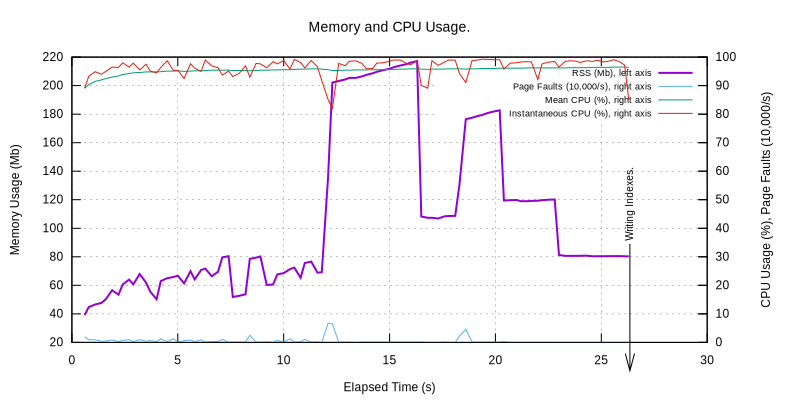
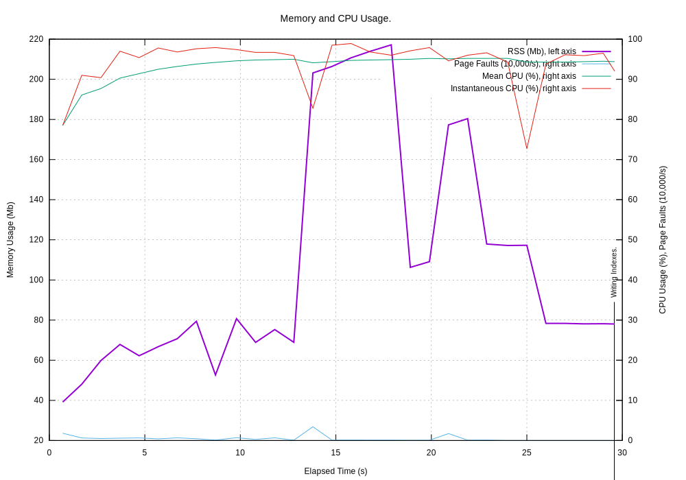
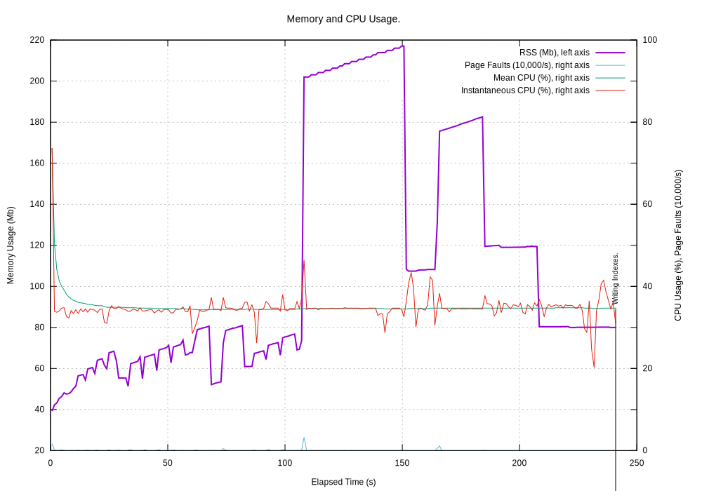
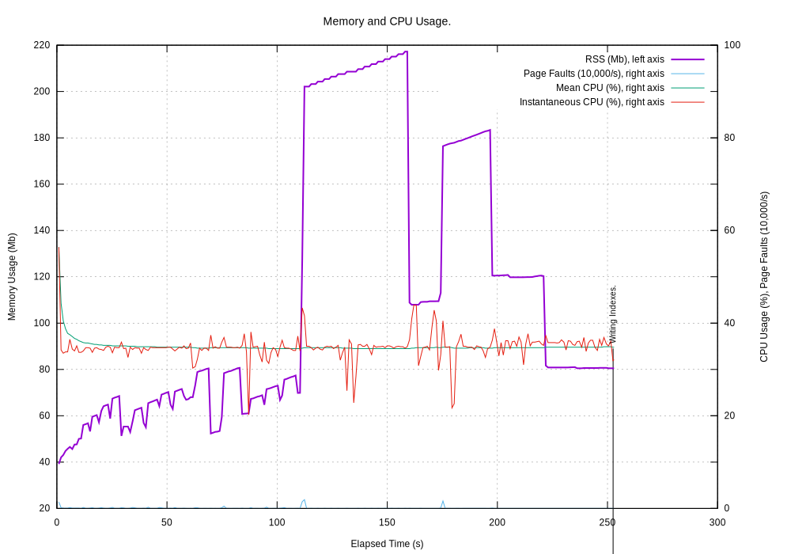
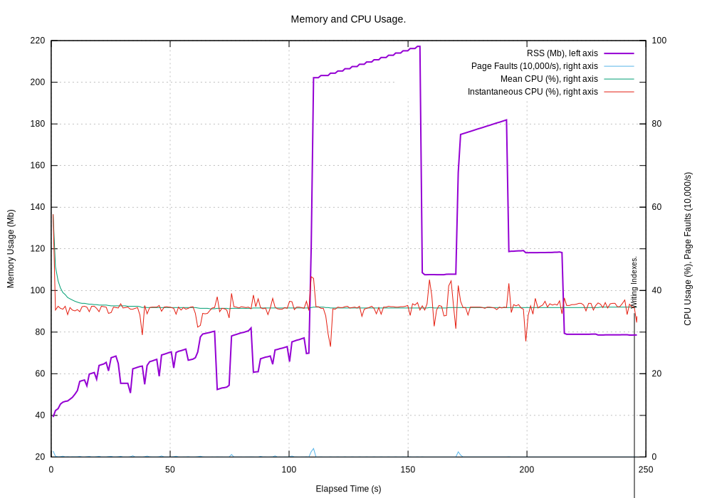
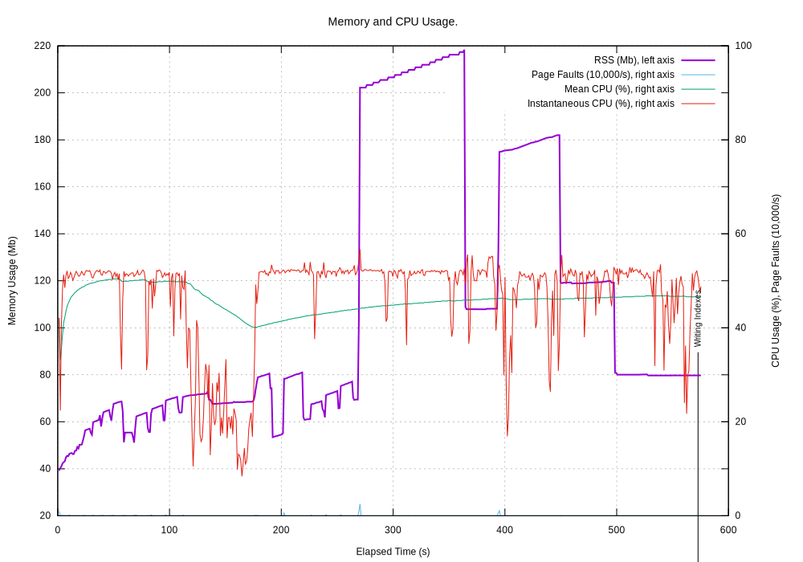
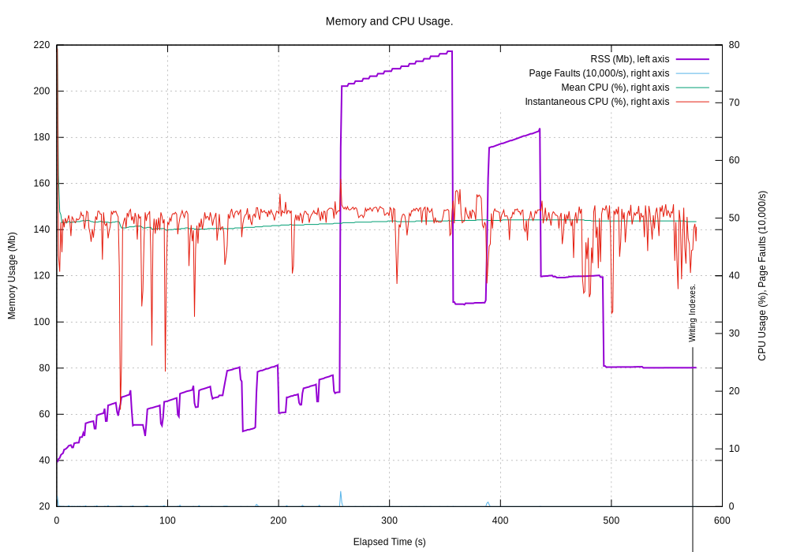

.. _tech_notes-cpymemtrace:

Technical Note on ``cPyMemTrace``
======================================

``cPyMemTrace`` is a Python profiler written in 'C' that records the `Resident Set Size <https://en.wikipedia.org/wiki/Resident_set_size>`_
for every Python and C call and return.
It writes this data to a log file with a name of the form ``YYMMDD_HHMMSS_PID.log``.

.. _tech_notes-cpymemtrace_test_data:

Test Program and Data
------------------------------

This tests the performance of ``cPyMenTrace`` with a real world program.
The program reads remote sensing structured text files containing static data and dynamic arrays of floating point data
and summarised them as HTML pages [#]_.
The input was 82 files totalling 108Mb.
The largest file was 27,330,513 bytes, smallest 4,609 bytes.
The output was 111 HTML files and indexes totaling 7.2Mb
Platform was a Mac mini (late 2014) 2.8 GHz Intel Core i5 running macOS Mojave 10.14.6.

The memory usage was monitored by ``pymemtrace.process.py`` which is a RSS monitor that runs in a separate thread and
reports the RSS at regular intervals.
The cost in runtime and memory is minimal.
The tick time was set to 0.25s for no use of ``cPyMemTrace`` and 1.0s when using ``cPyMenTrace``.

No use of ``cPyMemTrace``
--------------------------------------------

This is the baseline run with no tracing which took 25.8s [#]_

``cPyMemTrace`` No Events Computed, No Events Logged
-------------------------------------------------------

This was to establish the overhead of calling ``trace_or_profile_function()`` but merely incrementing the event counter.
Nothing is calculated.
Nothing is logged [#]_.

Time was 29.3s, that is baseline x1.14

``cPyMemTrace`` RSS Only Computed, No Events Logged
-------------------------------------------------------

This was to establish the overhead of calling ``trace_or_profile_function()`` as before but also computing just the RSS.
Nothing is logged [#]_.

It is notable that the CPU is averaging around 35%:
Time was 241.2s, that is baseline x9.35

``cPyMemTrace`` All Events Computed, No Events Logged
-------------------------------------------------------

This was to establish the overhead of calling ``trace_or_profile_function()`` and calculating all the log file data but
not actually logging any of it [#]_.

Time was 252.6s, that is baseline x9.8

``cPyMemTrace`` All Events Computed, RSS changes >=4096 bytes Logged
-------------------------------------------------------------------------

This was to establish the overhead of calling ``trace_or_profile_function()`` and extracting all the log file data but
only logging them if the RSS changed by >=±4096 bytes (one page) [#]_.

Time was 246.3s, that is baseline x9.55

Example log file:

.. code-block:: text

    Event        Clock        What     File                                                                                                                    #line Function                                  RSS
    0            0.630983     CALL     /Library/Frameworks/Python.framework/Versions/3.8/lib/python3.8/contextlib.py                                           # 238 helper                               41041920     41041920
    42           0.631218     CALL     TotalDepth3.8_develop/lib/python3.8/site-packages/psutil/__init__.py                                                    # 818 create_time                          41046016         4096
    49           0.631308     C_RETURN TotalDepth3.8_develop/lib/python3.8/site-packages/psutil/_psosx.py                                                      # 388 proc_kinfo_oneshot                   41050112         4096
    69           0.631455     C_RETURN /Library/Frameworks/Python.framework/Versions/3.8/lib/python3.8/threading.py                                            # 852 start_new_thread                     41058304         8192
    86           0.631517     CALL     /Library/Frameworks/Python.framework/Versions/3.8/lib/python3.8/threading.py                                            # 255 _release_save                        41062400         4096
    91           0.632319     C_RETURN /Library/Frameworks/Python.framework/Versions/3.8/lib/python3.8/threading.py                                            # 302 acquire                              41127936        65536
    395          0.633236     C_RETURN /Library/Frameworks/Python.framework/Versions/3.8/lib/python3.8/os.py                                                   # 362 next                                 41132032         4096
    516          0.633493     C_RETURN /Library/Frameworks/Python.framework/Versions/3.8/lib/python3.8/os.py                                                   # 362 next                                 41136128         4096
    760          0.634132     CALL     TotalDepth/src/TotalDepth/util/bin_file_type.py                                                                         # 318 _xml                                 41140224         4096
    1401         0.636083     C_RETURN TotalDepth/src/TotalDepth/LAS/core/LASRead.py                                                                           # 116 readline                             41148416         8192
    1452         0.636243     CALL     TotalDepth/src/TotalDepth/LAS/core/LASRead.py                                                                           # 248 add_member_line                      41152512         4096
    1468         0.636285     CALL     TotalDepth/src/TotalDepth/LAS/core/LASRead.py                                                                           # 212 <listcomp>                           41156608         4096
    2427         0.637908     C_RETURN TotalDepth/src/TotalDepth/LAS/core/LASRead.py                                                                           # 203 match                                41160704         4096
    2868         0.638694     C_CALL   TotalDepth/src/TotalDepth/LAS/core/LASRead.py                                                                           # 177 isinstance                           41164800         4096
    3604         0.639905     C_CALL   TotalDepth/src/TotalDepth/LAS/core/LASRead.py                                                                           # 177 isinstance                           41168896         4096
    4169         0.640997     C_RETURN TotalDepth/src/TotalDepth/LAS/core/LASRead.py                                                                           # 179 lower                                41172992         4096

There were 138,243,077 events and the log file contained:

* Lines: 74,518 (i.e. 1 in 1,855 events)
* Words: 670,302
* Bytes: 16,393,947

``cPyMemTrace`` Event RSS changes >=4096 bytes and Previous Event Logged
-------------------------------------------------------------------------

This was a compromise of only logging events if the RSS changed by >=±4096 bytes (one page) **plus** the immediately previous event.
The calculation cost is as much as logging every event (as any event can be a previous event) but the log file is much more manageable [#]_.

Time was 574.5s, that is baseline x22.3
It is notable that the CPU is around 50%.

Example log file:

.. code-block:: text

          Event        dEvent  Clock        What     File                                                                            #line Function                                  RSS         dRSS
    NEXT: 0            +0      0.684542     CALL     /Library/Frameworks/Python.framework/Versions/3.8/lib/python3.8/contextlib.py   # 238 helper                               41070592     41070592
    PREV: 22           +22     0.684800     RETURN   /Library/Frameworks/Python.framework/Versions/3.8/lib/python3.8/threading.py    # 507 __init__                             41070592            0
    ...
    PREV: 430          +339    0.689213     C_CALL   /Library/Frameworks/Python.framework/Versions/3.8/lib/python3.8/os.py           # 362 next                                 41152512            0
    NEXT: 431          +340    0.689223     C_RETURN /Library/Frameworks/Python.framework/Versions/3.8/lib/python3.8/os.py           # 362 next                                 41156608         4096
    PREV: 515          +84     0.689540     C_CALL   /Library/Frameworks/Python.framework/Versions/3.8/lib/python3.8/os.py           # 362 next                                 41156608            0
    NEXT: 516          +85     0.689547     C_RETURN /Library/Frameworks/Python.framework/Versions/3.8/lib/python3.8/os.py           # 362 next                                 41160704         4096
    PREV: 759          +243    0.690609     RETURN   /Library/Frameworks/Python.framework/Versions/3.8/lib/python3.8/logging/__init__.py#2080 debug                                41160704            0
    NEXT: 760          +244    0.690617     CALL     TotalDepth/src/TotalDepth/util/bin_file_type.py                                 # 318 _xml                                 41164800         4096
    PREV: 1396         +636    0.693267     RETURN   /Library/Frameworks/Python.framework/Versions/3.8/lib/python3.8/codecs.py       # 333 getstate                             41164800            0
    NEXT: 1397         +637    0.693376     CALL     /Library/Frameworks/Python.framework/Versions/3.8/lib/python3.8/codecs.py       # 319 decode                               41168896         4096
    PREV: 1438         +41     0.693591     RETURN   TotalDepth/src/TotalDepth/LAS/core/LASRead.py                                   # 235 __init__                             41168896            0
    NEXT: 1439         +42     0.693600     CALL     TotalDepth/src/TotalDepth/LAS/core/LASRead.py                                   # 825 _add_members_to_section              41172992         4096
    PREV: 1451         +12     0.693686     C_RETURN TotalDepth/src/TotalDepth/LAS/core/LASRead.py                                   # 831 startswith                           41172992            0
    NEXT: 1452         +13     0.693694     CALL     TotalDepth/src/TotalDepth/LAS/core/LASRead.py                                   # 248 add_member_line                      41177088         4096
    PREV: 1467         +15     0.693754     C_RETURN TotalDepth/src/TotalDepth/LAS/core/LASRead.py                                   # 212 groups                               41177088            0
    NEXT: 1468         +16     0.693762     CALL     TotalDepth/src/TotalDepth/LAS/core/LASRead.py                                   # 212 <listcomp>                           41181184         4096
    ...
    PREV: 2947962      +125    11.037511    RETURN   TotalDepth/src/TotalDepth/common/LogPass.py                                     #  95 __getitem__                          50446336            0
    NEXT: 2947963      +126    11.037517    CALL     TotalDepth/src/TotalDepth/common/LogPass.py                                     #  92 __getitem__                          50450432         4096
    PREV: 2970784      +22821  11.108340    C_CALL   TotalDepth/src/TotalDepth/LAS/core/LASRead.py                                   # 527 clear                                50450432            0
    NEXT: 2970785      +22822  11.109189    C_RETURN TotalDepth/src/TotalDepth/LAS/core/LASRead.py                                   # 527 clear                                49676288      -774144
    PREV: 3048415      +77630  11.378371    C_RETURN TotalDepth/src/TotalDepth/common/np_summary.py                                  #  87 flatten                              49676288            0
    NEXT: 3048416      +77631  11.378496    C_CALL   TotalDepth/src/TotalDepth/common/np_summary.py                                  #  89 len                                  49770496        94208
    PREV: 3048667      +251    11.380147    C_RETURN TotalDepth/src/TotalDepth/common/np_summary.py                                  #  99 len                                  49770496            0
    NEXT: 3048668      +252    11.380398    C_CALL   TotalDepth/src/TotalDepth/common/np_summary.py                                  # 102 mean                                 49958912       188416
    PREV: 3048690      +22     11.380568    RETURN   TotalDepth/src/TotalDepth/common/np_summary.py                                  # 103 activity                             49958912            0
    NEXT: 3048691      +23     11.380835    CALL     <string>                                                                        #   1 __new__                              49102848      -856064
    PREV: 3048695      +4      11.380856    RETURN   TotalDepth/src/TotalDepth/common/np_summary.py                                  # 133 summarise_array                      49102848            0
    NEXT: 3048696      +5      11.380930    CALL     TotalDepth/src/TotalDepth/common/LogPass.py                                     #  80 ident                                48840704      -262144

Out of 138,243,077 events the log file contained:

* Lines: 146,037 (about 1 in 950 of the full log).
* Words: 1,604,835
* Bytes: 28,341,012

``cPyMemTrace`` Every Event Computed and Logged
-------------------------------------------------------------------------

Everything was logged [#]_

Time was 576.7s, that is baseline x22.349

Example log file:

.. code-block:: text

    Event        Clock        What     File                                                                                                                    #line Function                                  RSS
    0            0.621555     CALL     /Library/Frameworks/Python.framework/Versions/3.8/lib/python3.8/contextlib.py                                           # 238 helper                               41082880     41082880
    1            0.621585     CALL     /Library/Frameworks/Python.framework/Versions/3.8/lib/python3.8/contextlib.py                                           #  82 __init__                             41082880            0
    2            0.621606     C_CALL   /Library/Frameworks/Python.framework/Versions/3.8/lib/python3.8/contextlib.py                                           #  86 getattr                              41082880            0
    3            0.621615     C_RETURN /Library/Frameworks/Python.framework/Versions/3.8/lib/python3.8/contextlib.py                                           #  86 getattr                              41082880            0
    4            0.621622     RETURN   /Library/Frameworks/Python.framework/Versions/3.8/lib/python3.8/contextlib.py                                           #  89 __init__                             41082880            0
    5            0.621625     RETURN   /Library/Frameworks/Python.framework/Versions/3.8/lib/python3.8/contextlib.py                                           # 240 helper                               41082880            0
    6            0.621631     CALL     /Library/Frameworks/Python.framework/Versions/3.8/lib/python3.8/contextlib.py                                           # 108 __enter__                            41082880            0
    7            0.621636     C_CALL   /Library/Frameworks/Python.framework/Versions/3.8/lib/python3.8/contextlib.py                                           # 113 next                                 41082880            0
    8            0.621640     CALL     TotalDepth/src/TotalDepth/common/process.py                                                                             # 307 log_process                          41082880            0
    9            0.621655     CALL     TotalDepth/src/TotalDepth/common/process.py                                                                             # 251 __init__                             41082880            0
    10           0.621668     CALL     /Library/Frameworks/Python.framework/Versions/3.8/lib/python3.8/threading.py                                            # 761 __init__                             41082880            0
    ...
    138243324    550.608830   RETURN   /Library/Frameworks/Python.framework/Versions/3.8/lib/python3.8/threading.py                                            #1029 _wait_for_tstate_lock                84070400            0
    138243325    550.608835   RETURN   /Library/Frameworks/Python.framework/Versions/3.8/lib/python3.8/threading.py                                            #1015 join                                 84070400            0
    138243326    550.608841   RETURN   TotalDepth/src/TotalDepth/common/process.py                                                                             # 304 join                                 84070400            0
    138243327    550.608878   RETURN   TotalDepth/src/TotalDepth/common/process.py                                                                             # 315 log_process                          84070400            0
    138243328    550.608885   CALL     /Library/Frameworks/Python.framework/Versions/3.8/lib/python3.8/_weakrefset.py                                          #  38 _remove                              84070400            0
    138243329    550.608892   C_CALL   /Library/Frameworks/Python.framework/Versions/3.8/lib/python3.8/_weakrefset.py                                          #  44 discard                              84070400            0
    138243330    550.608894   C_RETURN /Library/Frameworks/Python.framework/Versions/3.8/lib/python3.8/_weakrefset.py                                          #  44 discard                              84070400            0
    138243331    550.608898   RETURN   /Library/Frameworks/Python.framework/Versions/3.8/lib/python3.8/_weakrefset.py                                          #  44 _remove                              84070400            0
    138243332    550.608908   C_EXCEPT /Library/Frameworks/Python.framework/Versions/3.8/lib/python3.8/contextlib.py                                           # 120 next                                 84070400            0
    138243333    550.608915   RETURN   /Library/Frameworks/Python.framework/Versions/3.8/lib/python3.8/contextlib.py                                           # 122 __exit__                             84070400            0

The log file contained 138,243,334 events:

* Lines: 138,243,335
* Words: 1,235,888,202
* Bytes: 30,413,538,865

Summary
------------------

Here are the overall times and the event rate for different configurations:

+--------+------------+---------------------------------+----------+---------+----------------+-----------------+
| Trace? | Calculate? | Log?                            | Time (s) | Ratio   | Events Logged  | Actual Events/s |
+========+============+=================================+==========+=========+================+=================+
| No     | No         | No                              | 25.8     | x1.0    | 0              | 5.4m            |
+--------+------------+---------------------------------+----------+---------+----------------+-----------------+
| Yes    | No         | No                              | 29.4     | x1.14   | 0              | 4.7m            |
+--------+------------+---------------------------------+----------+---------+----------------+-----------------+
| Yes    | RSS        | No                              | 241.2    | x9.35   | 0              | 0.57m           |
+--------+------------+---------------------------------+----------+---------+----------------+-----------------+
| Yes    | All        | No                              | 252.6    | x9.79   | 0              | 0.55m           |
+--------+------------+---------------------------------+----------+---------+----------------+-----------------+
| Yes    | All        | dRSS >= 4096                    | 246.3    | x9.55   | 74,518         | 0.56m           |
+--------+------------+---------------------------------+----------+---------+----------------+-----------------+
| Yes    | All        | dRSS >= 4096 and previous event | 574.5    | x22.3   | 146,037        | 0.24m           |
+--------+------------+---------------------------------+----------+---------+----------------+-----------------+
| Yes    | All        | All                             | 576.6    | x22.3   | 138,243,334    | 138m            |
+--------+------------+---------------------------------+----------+---------+----------------+-----------------+

Cost of Tracing
^^^^^^^^^^^^^^^^^^^^^^^^^^^^

For the 138,243,335 events (or 74,517 that are >= 4096) the run time can be used to calculate the the cost per event:

+------------------------------------+---------------------------+-----------------------------------------+
| Part of Tracing                    | Runtime cost in µs/event. | Notes.                                  |
+====================================+===========================+=========================================+
| Typical Python code                | 0.1 to 0.2                |                                         |
+------------------------------------+---------------------------+-----------------------------------------+
| Attach and call C a trace function | 0.2                       | This is gratifingly quick.              |
+------------------------------------+---------------------------+-----------------------------------------+
| Calculate RSS                      | 1.5                       | This is quite slow.                     |
|                                    |                           | See: :ref:`tech_notes-rss_cost`         |
+------------------------------------+---------------------------+-----------------------------------------+
| Log an event                       | 2.5                       | Also slow. Formatting (?).              |
+------------------------------------+---------------------------+-----------------------------------------+

It is fairly understandable that the formatting and logging takes a while but it is interesting that computing the RSS is so expensive.
This is investigated in a bit more detail in :ref:`tech_notes-rss_cost`.

Conclusion
-----------------

* The C code is much faster than the legacy Python ``pymemtrace`` code, probably by a factor of x20 or so.
* A x10 to x22 runtime overhead is probably the best we can do.
* Zero memory cost is great.

.. rubric:: Footnotes
.. [#] TotalDepth was used to summarise LAS files in HTML. Source data was the W005862 directory but with the MDT directory removed.
.. [#] Output in ``tmp/LAS/cPyMemTrace/LASToHtml_no_trace/LASToHTML.log``
.. [#] Output in ``tmp/LAS/cPyMemTrace/LASToHtml_trace_C/LASToHTML.log`` and ``20201102_112240_9434.log``
.. [#] Output in ``tmp/LAS/cPyMemTrace/LASToHtml_trace_D/LASToHTML.log`` and ``20201102_113300_9552.log``
.. [#] Output in ``tmp/LAS/cPyMemTrace/LASToHtml_trace_B/LASToHTML.log`` and ``20201102_111258_9236.log``
.. [#] Output in ``tmp/LAS/cPyMemTrace/LASToHtml_trace_E/LASToHTML.log`` and ``20201102_114815_9685.log``
.. [#] Output in ``tmp/LAS/cPyMemTrace/LASToHtml_trace_J/LASToHTML.log`` and ``20201104_100554_20328.log``
.. [#] Output in ``tmp/LAS/cPyMemTrace/LASToHtml_trace_A/LASToHTML.log`` and ``20201102_101701_8692.log``
