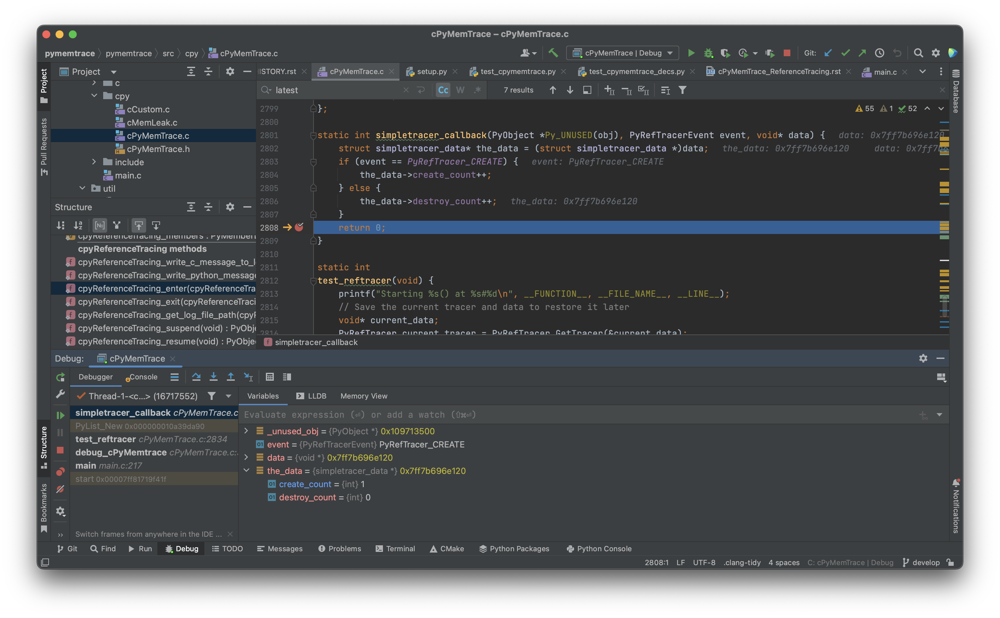

.. _tech_notes-cpymemtrace_reference_tracing:

Technical Note on ``cPyMemTrace`` Reference Tracing
===================================================

From Python 3.13 onwards Python supports
`Reference Tracing <https://docs.python.org/3/c-api/profiling.html#reference-tracing>`_.
This enables us to track every Python allocation and de-allocation.
The class that does this is :py:class:`cPyMemTrace.ReferenceTracing`.

.. warning::

    The Reference Tracing API is in flux.
    It was introduced in Python 3.13 and is fairly immature.
    For example the ``PyRefTracer_TRACKER_REMOVED`` event was supposed to be implemented in Python 3.14
    and it appears in the documentation for that version.
    However ``PyRefTracer_TRACKER_REMOVED`` does not occur in the Python 3.14 source code.
    Perhaps this is a case of the documentation out running the code.

How Reference Tracing Works
---------------------------

Reference tracing is initiated by calling the CPython API
`PyRefTracer_SetTracer <https://docs.python.org/3/c-api/profiling.html#c.PyRefTracer_SetTracer>`_
which has this prototype:

.. code-block:: c

    int PyRefTracer_SetTracer(PyRefTracer tracer, void *data)

The arguments are:

- `PyRefTracer <https://docs.python.org/3/c-api/profiling.html#c.PyRefTracer>`_ which is a callback function,
  the signature is described below.
- A ``void *`` opaque pointer to a structure that will be passed to the callback function as an argument.
  This allows you to hold state between tracing events.
  This can be ``NULL``.

The callback function signature is:

.. code-block:: c

    int (*PyRefTracer)(PyObject*, int event, void *data)

The first parameter is a Python object that has been just created (when event is set to
`PyRefTracer_CREATE <https://docs.python.org/3/c-api/profiling.html#c.PyRefTracer_CREATE>`_)
or about to be destroyed (when event is set to
`PyRefTracer_DESTROY <https://docs.python.org/3/c-api/profiling.html#c.PyRefTracer_DESTROY>`_).

The data argument is the opaque pointer that was provided when
`PyRefTracer_SetTracer <https://docs.python.org/3/c-api/profiling.html#c.PyRefTracer_SetTracer>`_
was called.
This allows arbitrary accumulation of data.

Reference Tracing is fairy new and, as it intercepts every Python object allocation and de-allocation, is very invasive.
This provides a number of failure modes.

.. _tech_notes-cpymemtrace_reference_tracing_simple:

A Simple Reference Tracer
-------------------------

Here is an example of a simple reference tracer.
It is based on the CPython 3.13/3.14 code in ``Modules/_testcapimodule.c`` which is, as far as I can see,
the sole test code for Reference Tracing.

First declare a data block that accumulates allocation and de-allocation counts:

.. code-block:: c

    struct simpletracer_data {
        int create_count;
        int destroy_count;
    };

Now write the callback function that will be invoked with each allocation and de-allocation:

.. code-block:: c

    static int simpletracer_callback(PyObject *Py_UNUSED(obj),
                                     PyRefTracerEvent event,
                                     void* data) {
        struct simpletracer_data* the_data = (struct simpletracer_data *)data;
        if (event == PyRefTracer_CREATE) {
            the_data->create_count++;
        } else if (event == PyRefTracer_DESTROY) {
            the_data->destroy_count++;
        } else {
            /* NOTE: PyRefTracer_TRACKER_REMOVED is ignored here as that API is not
             * yet stable.
             * It was claimed in the Python documentation to be implemented in
             * Python 3.14 but was actually only implemented in Python 3.15.
             */
        }
        return 0;
    }

Now some test code that executes this within a CPython runtime.
This is in ``test_reftracer()`` in ``pymemtrace/src/cpy/cPyMemTrace.c``:

.. code-block:: c

    static int
    test_reftracer(void) {
        printf("Starting %s() at %s#%d\n", __FUNCTION__, __FILE_NAME__, __LINE__);
        // Save the current tracer and data to restore it later
        void* current_data;
        PyRefTracer current_tracer = PyRefTracer_GetTracer(&current_data);

        struct simpletracer_data tracer_data = {0};
        void* the_data = &tracer_data;
        // Install a simple tracer function
        if (PyRefTracer_SetTracer(simpletracer_callback, the_data) != 0) {
            goto failed;
        }

        // Check that the tracer was correctly installed
        void* data;
        if (PyRefTracer_GetTracer(&data) != simpletracer_callback || data != the_data) {
            PyErr_SetString(
                PyExc_AssertionError, "The reftracer not correctly installed"
            );
            (void)PyRefTracer_SetTracer(NULL, NULL);
            goto failed;
        }

        // Create a bunch of objects
        PyObject* obj = PyList_New(0);
        if (obj == NULL) {
            goto failed;
        }
        PyObject* obj2 = PyDict_New();
        if (obj2 == NULL) {
            Py_DECREF(obj);
            goto failed;
        }

        // Kill all objects
        Py_DECREF(obj);
        Py_DECREF(obj2);

        // Remove the tracer
        (void)PyRefTracer_SetTracer(NULL, NULL);

        // Check that the tracer was removed
        if (PyRefTracer_GetTracer(&data) != NULL || data != NULL) {
            PyErr_SetString(
                PyExc_ValueError, "The reftracer was not correctly removed"
            );
            goto failed;
        }

        if (tracer_data.create_count != 2) {
            PyErr_SetString(
                PyExc_ValueError, "The object creation was not correctly traced"
            );
            goto failed;
        }

        if (tracer_data.destroy_count != 2) {
            PyErr_SetString(
                PyExc_ValueError, "The object destruction was not correctly traced"
            );
            goto failed;
        }
        PyRefTracer_SetTracer(current_tracer, current_data);
        printf("DONE %s() at %s#%d\n", __FUNCTION__, __FILE_NAME__, __LINE__);
        return 0;
    failed:
        PyRefTracer_SetTracer(current_tracer, current_data);
        printf("FAILED %s() at %s#%d\n", __FUNCTION__, __FILE_NAME__, __LINE__);
        return -1;
    }

You can run this in the C project under the debugger and set a breakpoint in the callback function:

.. raw:: latex

    [Continued on the next page]

    \pagebreak

.. raw:: latex

    \begin{landscape}

.. raw:: latex

    \end{landscape}

A More Useful Reference Tracer
------------------------------

Just counting allocations and de-allocations is not very useful.
:py:class:`pymemtrace.cPyMemTrace.ReferenceTracing` logs each allocation and de-allocation
with the object type and location of the action.
See :ref:`examples-cpymemtrace-reference-tracing` for how this is used and the results of tracing.

This, however, has a number of pitfalls.

Guarding Against a Stack Overflow
---------------------------------

If the Reference Tracing callback function interacts with the CPython runtime then that is free to create
or destroy arbitrary objects.
Each of these actions will call the callback function and this behaves recursively which will lead
to a stack overflow.

The solution is that the callback function should immediately suspend Reference Tracing before interacting
with the CPython API then restore the Reference Tracing when done.
For example:

.. code-block:: c

    static int
    reference_trace_callback(PyObject *obj, PyRefTracerEvent event, void *data) {
        assert(obj);
        assert(data);

        const int ERROR_CODE = -1;
        /* Get the Reference Tracer. */
        void *data_old = NULL;
        PyRefTracer tracer_old = PyRefTracer_GetTracer(&data_old);

        /* Sanity check. */
        assert(tracer_old);
        assert(tracer_old == &reference_trace_callback);
        assert(data_old);
        assert(data_old == data);

        /* Switch off Reference Tracing. */
        if (PyRefTracer_SetTracer(NULL, NULL)) {
            /* Do not set an exception. See:
             * https://docs.python.org/3/c-api/profiling.html#c.PyRefTracer_SetTracer */
            fprintf(stderr, "PyRefTracer_SetTracer(NULL, NULL) failed.\n");
            return ERROR_CODE;
        }

        /* Now we can interact with CPython ... */

        /* Restore the Reference Tracer before returning. */
        if (PyRefTracer_SetTracer(tracer_old, data_old)) {
            /* Do not set an exception. See:
             * https://docs.python.org/3/c-api/profiling.html#c.PyRefTracer_SetTracer */
            fprintf(stderr, "PyRefTracer_SetTracer(tracer_old, data_old) failed.\n");
            return ERROR_CODE;
        }
        return 0;
    }

.. warning::

    Python 3.15 introduces the
    `PyRefTracer_TRACKER_REMOVED <https://docs.python.org/3/c-api/profiling.html#c.PyRefTracer_TRACKER_REMOVED>`_
    event that will cause this function, as written above, to be re-entrant.

Issues with ``pytest``
----------------------

``pytest`` rewrites asserts and this can play havoc with a Reference Tracer.
Consider this innocuous test:

.. code-block:: python

    @pytest.mark.skipif(not (sys.version_info.minor >= 13), reason='Python >= 3.13')
    def test_trace_basic_list_cmp_suspend_resume_gt_313():
        with cPyMemTrace.ReferenceTracing() as profiler:
            assert ['a', 'b', 'c', ] == ['a', 'b', 'c', 'd', ]

With a debug version of Python 3.13.2 his generates a huge (177MB) log file before aborting.
The abort happens here:

.. code-block:: text

    8   python.exe  0x10f024d91 _PyFrame_MakeAndSetFrameObject.cold.3 + 33 (frame.c:48)

The source for ``Python/frame.c`` shows the assert itself.

.. code-block:: text

    41     // GH-97002: There was a time when a frame object could be created when we
    42     // are allocating the new frame object f above, so frame->frame_obj would
    43     // be assigned already. That path does not exist anymore. We won't call any
    44     // Python code in this function and garbage collection will not run.
    45     // Notice that _PyFrame_New_NoTrack() can potentially raise a MemoryError,
    46     // but it won't allocate a traceback until the frame unwinds, so we are safe
    47     // here.
    48     assert(frame->frame_obj == NULL);

There are a huge  number of objects recorded in the log file 550 are live and 12,000+ have allocations and
the respective de-allocation.

There are two workarounds for this.

Firstly used two Reference Tracing methods:

- :py:meth:`~pymemtrace.cPyMemTrace.ReferenceTracing.suspend()` temporarily stops tracing.
- :py:meth:`~pymemtrace.cPyMemTrace.ReferenceTracing.resume()` resumes tracing.

.. code-block:: python

    @pytest.mark.skipif(not (sys.version_info.minor >= 13), reason='Python >= 3.13')
    def test_trace_basic_list_cmp_suspend_resume_gt_313():
        with cPyMemTrace.ReferenceTracing() as profiler:
            profiler.suspend()
            assert ['a', 'b', 'c', ] == ['a', 'b', 'c', 'd', ]
            profiler.resume()

Then pytest correctly reports:

.. code-block:: text

    >           assert ['a', 'b', 'c', ] == ['a', 'b', 'c', 'd', ]
    E           AssertionError: assert ['a', 'b', 'c'] == ['a', 'b', 'c', 'd']

And the log file is a manageable 11kB.

Another way is to use a temporary variable:

.. code-block:: python

    @pytest.mark.skipif(not (sys.version_info.minor >= 13), reason='Python >= 3.13')
    def test_trace_basic_list_cmp_suspend_resume_gt_313():
        with cPyMemTrace.ReferenceTracing() as profiler:
            result = ['a', 'b', 'c', ] == ['a', 'b', 'c','d', ]
            assert result

``pytest`` correctly reports:

.. code-block:: text

    >           assert result
    E           assert False

And the log file is a manageable 41kB.

``pytest`` provides a lot of challenges when dealing with Python C extensions.
