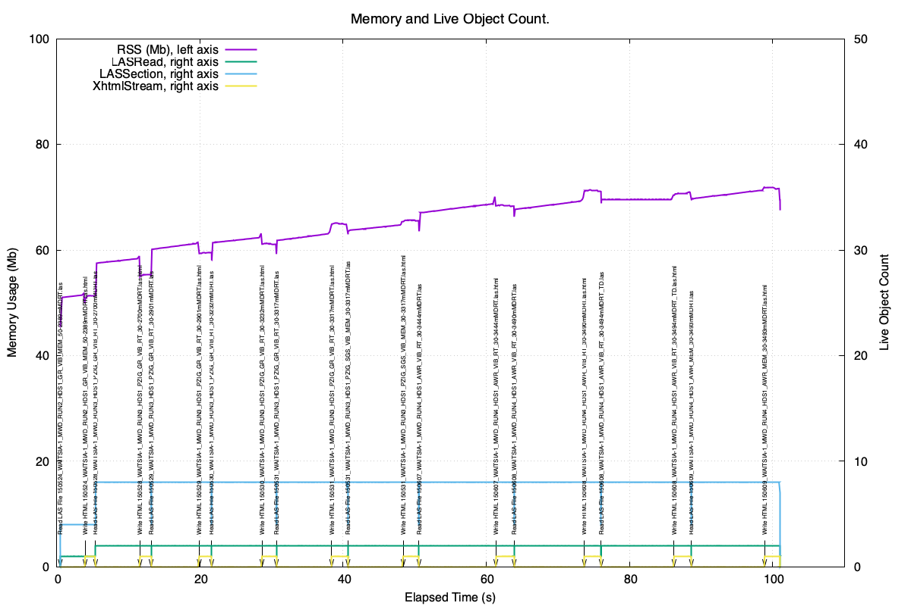
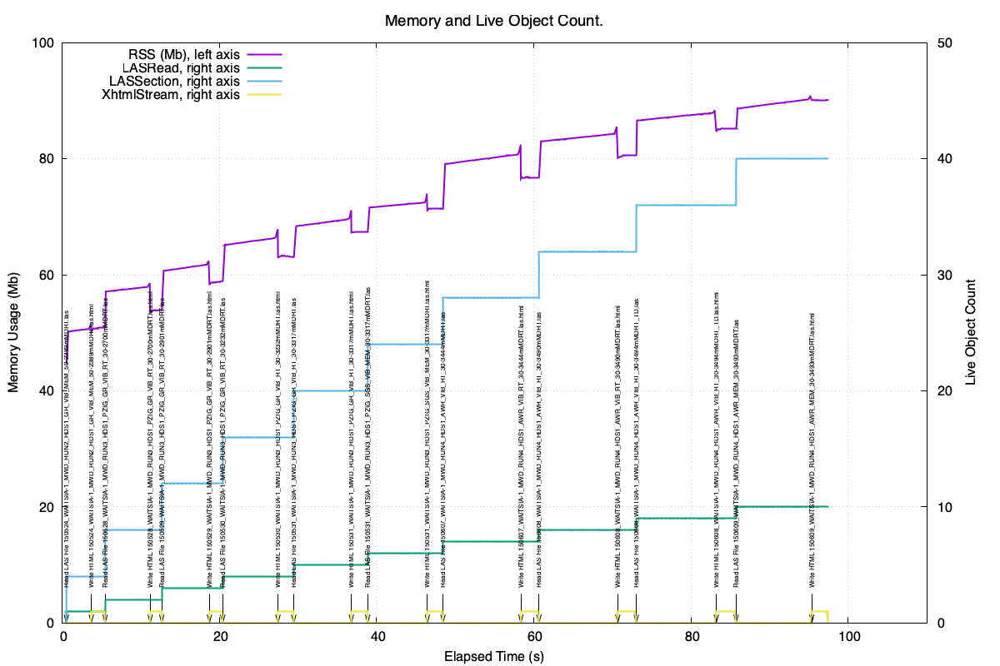

.. _tech_notes-cpymemtrace_reference_tracing_memory_leaks:

Using Reference Tracing to Detect Memory Leaks
===================================================

Reference Tracing logs every allocation and de-allocation and this can be very useful in detecting
memory leaks.
In this example we will deliberately create a memory leak and see how this is detected in the
log file.

Creating a Memory Leak
----------------------

The :py:mod:`pymemtrace.cMemLeak` has a number of classes that can create a memory demand.
The reference count of these objects can be manipulated directly and so we can cause a leak.
For example using :py:class:`pymemtrace.cMemLeak.CMalloc`:

.. code-block:: python

    from pymemtrace import cMemLeak

    obj = cMemLeak.CMalloc(1024)
    obj.inc_refcnt(1)

By incrementing the reference count we have prohibited the Python runtime from ever de-allocating the object.
A memory leak.

Lets create a function that creates a number of these objects and, optionally, leaks them.

.. code-block:: python

    from pymemtrace import cMemLeak

    def create_tmp_list_of_memory_objects(cause_leak: bool):
        l = []
        for i in range(4):
            obj = cMemLeak.CMalloc(1024)
            if cause_leak:
                obj.inc_refcnt(1)
            l.append(obj)
        while len(l):
            l.pop()

Using Reference Tracing
-----------------------

Firstly with no leak:

.. code-block:: python

    from pymemtrace import cPyMemTrace

    with cPyMemTrace.ReferenceTracing(
            include_tp_names=['cMemLeak.CMalloc',],
    ) as profiler:
        create_tmp_list_of_memory_objects(False)

This creates a log file that we can analyse with :py:mod:`pymemtrace.util.ref_trace_analyse`:

.. raw:: latex

    [Continued on the next page]

    \pagebreak

.. raw:: latex

    \begin{landscape}

.. code-block:: text

    File path: 20260419_120519_0_71199_O_0_PY3.13.2.log
    2026-04-19 13:05:37,142 - ref_trace_analyse.py#338 - INFO     - Lines: 12 NEW: 4 DEL: 4 NEW - DEL: 0 MSG: 0
    Initial Message:
    test_reference_tracing_deliberate_leak_to_cwd(): Class: CMallocObject Leak: False
    Untracked Objects [0]:
    Type                                        Count
    Live Objects [0]:
    Previous Objects [4]:
        0x6000034c1f90 cMemLeak.CMallocObject                   NEW: test_cpymemtrace.py#818 DEL: test_cpymemtrace.py#823
        0x6000034c2550 cMemLeak.CMallocObject                   NEW: test_cpymemtrace.py#818 DEL: test_cpymemtrace.py#823
        0x6000034c25d0 cMemLeak.CMallocObject                   NEW: test_cpymemtrace.py#818 DEL: test_cpymemtrace.py#823
        0x6000034c2690 cMemLeak.CMallocObject                   NEW: test_cpymemtrace.py#818 DEL: test_cpymemtrace.py#885
    Type count [1]:
    Type                                          New      Del  New - Del
    cMemLeak.CMallocObject                          4        4          0
    Process time: 0.001 (s)

.. raw:: latex

    \end{landscape}

This shows that the four objects were allocated and then de-allocated correctly.

Now with a leak:

.. code-block:: python

    from pymemtrace import cPyMemTrace

    with cPyMemTrace.ReferenceTracing(
            include_tp_names=['cMemLeak.CMalloc',],
    ) as profiler:
        create_tmp_list_of_memory_objects(True)

And this log file analysed with :py:mod:`pymemtrace.util.ref_trace_analyse` gives:

.. raw:: latex

    [Continued on the next page]

    \pagebreak

.. raw:: latex

    \begin{landscape}

.. code-block:: text

    python pymemtrace/util/ref_trace_analyse.py 20260419_120519_1_71199_O_0_PY3.13.2.log
    File path: 20260419_120519_1_71199_O_0_PY3.13.2.log
    2026-04-19 13:05:55,774 - ref_trace_analyse.py#338 - INFO     - Lines: 8 NEW: 4 DEL: 0 NEW - DEL: 4 MSG: 0
    Initial Message:
    test_reference_tracing_deliberate_leak_to_cwd(): Class: CMallocObject Leak: True
    Untracked Objects [0]:
    Type                                        Count
    Live Objects [4]:
        0x6000034c4090    4 cMemLeak.CMallocObject                   create_tmp_list_of_memory_objects test_cpymemtrace.py#818
        0x6000034c4110    4 cMemLeak.CMallocObject                   create_tmp_list_of_memory_objects test_cpymemtrace.py#818
        0x6000034c4290    4 cMemLeak.CMallocObject                   create_tmp_list_of_memory_objects test_cpymemtrace.py#818
        0x6000034c4390    4 cMemLeak.CMallocObject                   create_tmp_list_of_memory_objects test_cpymemtrace.py#818
    Previous Objects [0]:
    Type count [1]:
    Type                                          New      Del  New - Del
    cMemLeak.CMallocObject                          4        0          4
    Process time: 0.001 (s)

.. raw:: latex

    \end{landscape}

And that shows that the four objects are still 'alive'.

Whilst Reference Tracing can not pinpoint where a missing de-allocation should be it can certainly narrow down
what types are not being de-allocated correctly.

.. _tech_notes-cpymemtrace_reference_tracing_memory_leaks_plotting:

Plotting Memory Usage
---------------------

..
    This was done by running TotalDepth: time tdlastohtml -kvr --log-process=0.5 tmp/pymemtrace/W005862_test_data/S1R2_FMI-PPC-MSIP-PPC tmp/pymemtrace/H/S1R2_FMI-PPC-MSIP-PPC > tmp/pymemtrace/H/W005862_test_data_LWD.log
    $ mv 20260604_115452_0_21132_O_0_PY3.13.13.log tmp/pymemtrace/H
    Then with pymemtrace: time python pymemtrace/util/ref_trace_analyse.py ~/PycharmProjects/TotalDepth/tmp/pymemtrace/H/20260604_115452_0_21132_O_0_PY3.13.13.log --gnuplot-path=/Users/paulross/PycharmProjects/TotalDepth/tmp/pymemtrace/H/gnuplot_ref_trace --gnuplot-types=LASSection,LASSectionArray,LogRecord,XhtmlStream
    The the .plt file was hand edited to create nice looking scales.

:py:mod:`pymemtrace.util.ref_trace_analyse` has an option to plot with
``gnuplot`` the RSS usage and the object count.
This uses the ``--gnuplot-path`` for identifying the path to the
gnuplot output and ``--gnuplot-types`` to provide a comma seperated
list of types of interest.

Here is an example of a Python program reading ten geophysical data
files and writing a HTML summary file for each.
A ``MSG`` is inserted into the log file for every read and write with
the filename.
The Python code is instrumented with pymemtrace thus:

.. code-block:: python

    from pymemtrace import cPyMemTrace
    from pymemtrace import cpymemtrace_decs

    @cpymemtrace_decs.reference_tracing(
        message="LASToHTML include_builtins=False",
        include_builtins=False
    )
    def las_file_to_html(
        # Arguments here.
    ) -> None:
        cPyMemTrace.reference_tracing_write_message_to_log(
            f'Read LAS File "{os.path.basename(las_file_path)}'
        )
        las_file = LASRead.LASRead(
            las_file_path, las_file_path, raise_on_error=not keep_going
        )
        cPyMemTrace.reference_tracing_write_message_to_log(
            f'Write HTML "{os.path.basename(html_file_path)}'
        )
        with open(html_file_path, 'w') as html_file:
            # Write the HTML from las_file
            pass

As well as the :py:func:`pymemtrace.cpymemtrace_decs.reference_tracing`
decorator for each file we write a message to the log when reading the
input and another when writing the output.

This produces a 2.2G log file with nearly 10m lines.
:py:mod:`pymemtrace.util.ref_trace_analyse` is invoked like this
giving a ``gnuplot`` output directory and a list of types of interest:

.. code-block:: bash

    pymemtrace_ref_trace_analyse <log_file>.log --gnuplot-path=gnuplot_ref_trace --gnuplot-types=LASRead,LASSection,XhtmlStream

:py:mod:`pymemtrace.util.ref_trace_analyse` takes around 70s to
analyse this and produce this plot:

This shows the behaviour of the code, it looks pretty healthy,
the RSS is reclaimed and the live object count is moderate.

If however we deliberately introduce a memory leak in the ``LASRead``
object (and thus all the objects it contains) the plot looks quite
different:

So if you have a plot like the second one you definitely have a leak
and you know the type that is leaking.
This is very useful in tracking down objects that are not being
de-allocated.
