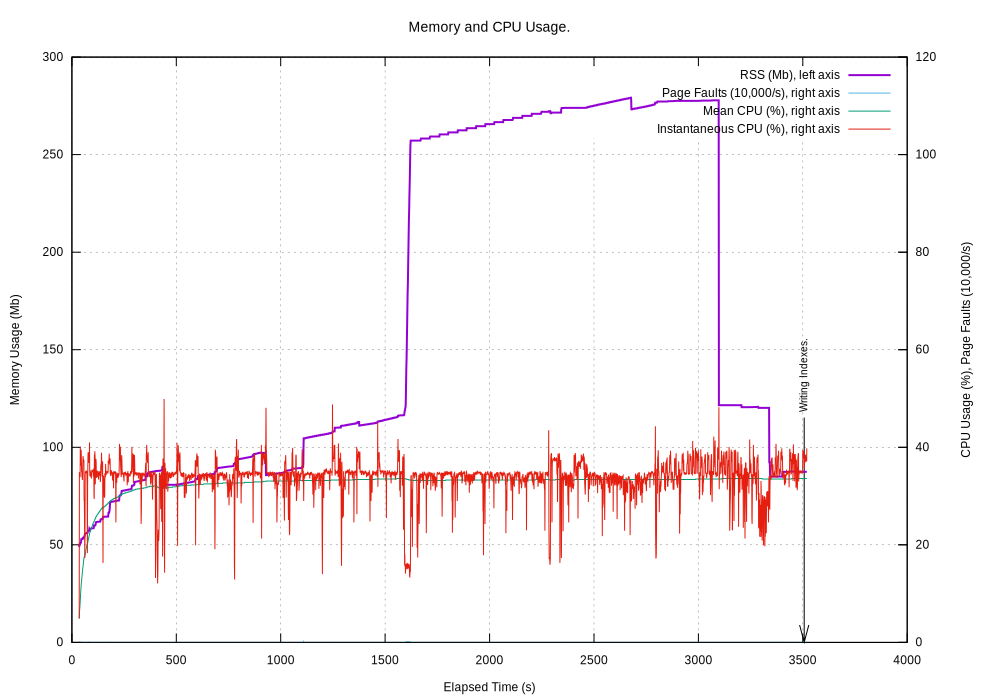

.. _tech_notes-dtrace:

Technical Note on DTrace
==========================

DTrace was also used on the same code and data that was used to test ``cPyMemTrace``.
See :ref:`tech_notes-cpymemtrace_test_data` [#]_.
This was traced with DTrace using ``toolkit/py_flow_malloc_free.d``:

.. code-block:: bash

    sudo dtrace -s toolkit/py_flow_malloc_free.d -p <PID> -C

Python Builds
----------------------------

Python 3.9 was configured and built with DTrace support.

Debug Build
^^^^^^^^^^^^^^^^^^^^

.. code-block:: bash

    configure --with-pydebug --without-pymalloc --with-valgrind --with-dtrace

.. note::

    Since this bypasses Python's small object allocator (``pymalloc``) then every ``malloc()`` and ``free()`` can be
    seen by DTrace.
    This makes the DTrace logs very large.

Release Build
^^^^^^^^^^^^^^^^^^^^

.. code-block:: bash

    configure --with-dtrace

Baseline: Python 3.9
---------------------------

This is using a standard build of Python 3.9 **without** DTrace support. It establishes a benchmark baseline:

 .. image:: images/LASToHTML.log_77077.svg
    :alt: Basic Python 3.9 (release) performance.
    :width: 800
    :align: center

Using ``time`` gives:

.. code-block:: text

    real        35.49
    user        29.72
    sys          2.03

Python 3.9 Release with DTrace support, no Tracing
---------------------------------------------------------

Python 3.9 (release) with DTrace support but *not* tracing with DTrace:

 .. image:: images/LASToHTML.log_76753.svg
    :alt: Python 3.9 (release) with DTrace capability.
    :width: 800
    :align: center

Using ``time`` gives:

.. code-block:: text

    real        49.54
    user        35.56
    sys          2.45

So a DTrace capable build has roughly a 40% premium in ``real`` time even when not tracing.

Python 3.9 Release with DTrace support, DTrace Tracing
---------------------------------------------------------

Python 3.9 (release) with DTrace support and DTrace running:

 .. image:: images/LASToHTML.log_77633.svg
    :alt: Python 3.9 (release) with DTrace capability, DTrace runnning.
    :width: 800
    :align: center

Using ``time`` gives:

.. code-block:: text

    real      3220.38
    user       902.51
    sys       1949.83

Note the increase in ``sys`` time caused by DTrace.
This is a x65 increase in runtime over a release build (not tracing) and a x91 increase over the non-DTrace baseline.

DTrace Log File
^^^^^^^^^^^^^^^^^^^^^^^

The log file [#]_ has 243,285 lines of which:

* 94,882 calls to ``malloc()``
* 144,684 calls to ``free()``. 74,254 of these are to ``free(0x0)``.

Python 3.9 Debug with DTrace support, no Tracing
---------------------------------------------------------

This is running a debug, DTrace capable build:

 .. image:: images/LASToHTML.log_3938.svg
    :alt: Python 3.9 (debug) with DTrace capability, DTrace not tracing.
    :width: 800
    :align: center

Using ``time`` gives:

.. code-block:: text

    real       148.55
    user       139.99
    sys          1.93

This is a x3 increase of runtime over a release DTrace capable build. This is typical for CPython debug builds.

.. Commented out:

    (TotalDepth3.9_develop)
    $ tdprocess tmp/LAS/cPyMemTrace/LASToHtml_trace_DTraceD_B/LASToHTML.log tmp/LAS/cPyMemTrace/LASToHtml_trace_DTraceD_B/gnuplot/
    2020-11-12 11:32:27,943 - process.py -  5108 - (MainThread) - INFO     - Extracting data from a log at tmp/LAS/cPyMemTrace/LASToHtml_trace_DTraceD_B/LASToHTML.log to tmp/LAS/cPyMemTrace/LASToHtml_trace_DTraceD_B/gnuplot/
    2020-11-12 11:32:27,981 - gnuplot.py -  5108 - (MainThread) - INFO     - gnuplot stdout: None
    2020-11-12 11:32:28,000 - gnuplot.py -  5108 - (MainThread) - INFO     - Writing gnuplot data "LASToHTML.log_3938" in path tmp/LAS/cPyMemTrace/LASToHtml_trace_DTraceD_B/gnuplot/
    2020-11-12 11:32:28,084 - gnuplot.py -  5108 - (MainThread) - INFO     - gnuplot stdout: None

Python 3.9 Debug with DTrace support, DTrace Tracing
---------------------------------------------------------

This is running a debug DTrace capable build *and* tracing with DTrace:

Using ``time`` gives:

.. code-block:: text

    real      3520.61
    user      1183.36
    sys       2127.22

This is a x24 increase in runtime over a debug build not tracing or a x99 increase in a non-DTrace build.

DTrace Log File
^^^^^^^^^^^^^^^^^^^^^^^

This has 16m lines of which there are:

* 8m calls to ``malloc()``
* 8m calls to ``free()``. 39,000 of these are to ``free(0x0)``.

.. Commented out:

    (TotalDepth3.9_develop)
    $ tdprocess tmp/LAS/cPyMemTrace/LASToHtml_trace_DTraceD_C/LASToHTML.log tmp/LAS/cPyMemTrace/LASToHtml_trace_DTraceD_C/gnuplot/
    2020-11-12 11:32:42,854 - process.py -  5119 - (MainThread) - INFO     - Extracting data from a log at tmp/LAS/cPyMemTrace/LASToHtml_trace_DTraceD_C/LASToHTML.log to tmp/LAS/cPyMemTrace/LASToHtml_trace_DTraceD_C/gnuplot/
    2020-11-12 11:32:42,892 - gnuplot.py -  5119 - (MainThread) - INFO     - gnuplot stdout: None
    2020-11-12 11:32:43,074 - gnuplot.py -  5119 - (MainThread) - INFO     - Writing gnuplot data "LASToHTML.log_4147" in path tmp/LAS/cPyMemTrace/LASToHtml_trace_DTraceD_C/gnuplot/
    2020-11-12 11:32:43,202 - gnuplot.py -  5119 - (MainThread) - INFO     - gnuplot stdout: None

Summary
----------------------

Here is a summary of the performance cost of using different builds and tracing with DTrace:

+-------------------------------------------------------------------+-----------+-----------+-----------+-------------------+
| Task                                                              | ``real``  | ``user``  | ``sys``   | ``real`` ratio    |
+===================================================================+===========+===========+===========+===================+
| Baseline                                                          | 35.5      | 29.7      | 2.03      | 1.0               |
+-------------------------------------------------------------------+-----------+-----------+-----------+-------------------+
| DTrace, no tracing                                                | 49.5      | 35.6      | 2.45      | x1.4              |
| Python release build using ``pymalloc``.                          |           |           |           |                   |
+-------------------------------------------------------------------+-----------+-----------+-----------+-------------------+
| DTrace, trace ``malloc()``, ``free()``.                           | 3220      | 903       | 1950      | x91               |
| Python release build using ``pymalloc``.                          |           |           |           |                   |
+-------------------------------------------------------------------+-----------+-----------+-----------+-------------------+
| DTrace, no tracing. Debug, not using ``pymalloc``                 | 148       | 134       | 1.93      | x4.2              |
+-------------------------------------------------------------------+-----------+-----------+-----------+-------------------+
| DTrace, trace ``malloc()``, ``free()``.                           | 3520      | 1180      | 2130      | x99               |
| Python debug build, not using ``pymalloc``.                       |           |           |           |                   |
+-------------------------------------------------------------------+-----------+-----------+-----------+-------------------+

DTrace Log File
^^^^^^^^^^^^^^^^^^^^^^^^^^^^^

Piping the DTrace output to a log file gives the following log files for this job.

+-----------------------------------+---------------+---------------+-----------------------+
| Build                             | Release       | Debug         | Ratio Debug/Release   |
+===================================+===============+===============+=======================+
| Size                              | 16 Mb         | 11,000 Mb     | x68                   |
+-----------------------------------+---------------+---------------+-----------------------+
| Lines                             | 243k          | 16m           | x68                   |
+-----------------------------------+---------------+---------------+-----------------------+
| ``malloc()`` entries              | 94,880        | 8,096,729     | x85                   |
+-----------------------------------+---------------+---------------+-----------------------+
| ``free()`` entries                | 144,684       | 8,054,421     | x56                   |
+-----------------------------------+---------------+---------------+-----------------------+
| ``free(0x0)`` entries             | 74,254        | 38,849        | x0.52                 |
+-----------------------------------+---------------+---------------+-----------------------+

.. rubric:: Footnotes
.. [#] This uses the LASToHTML from the TotalDepth project.
.. [#] Removing garbage from the DTrace log can be done with ``grep -o "[[:print:][:space:]]*" <LOG>``
