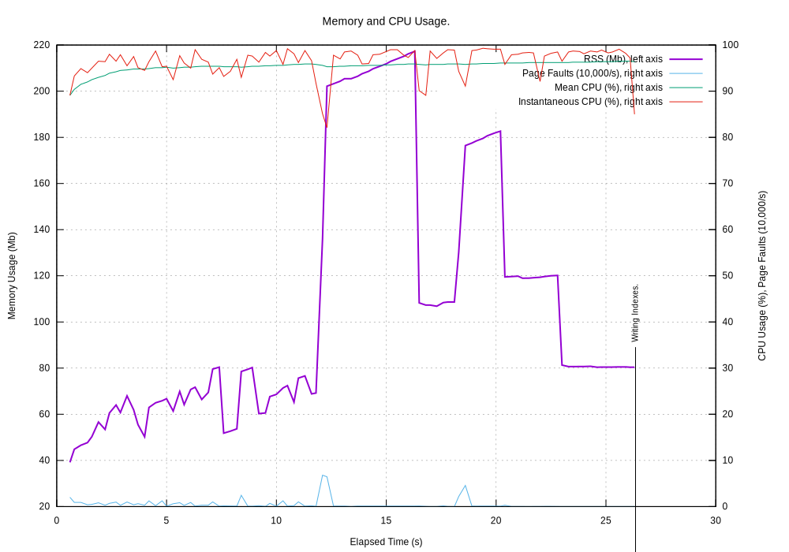
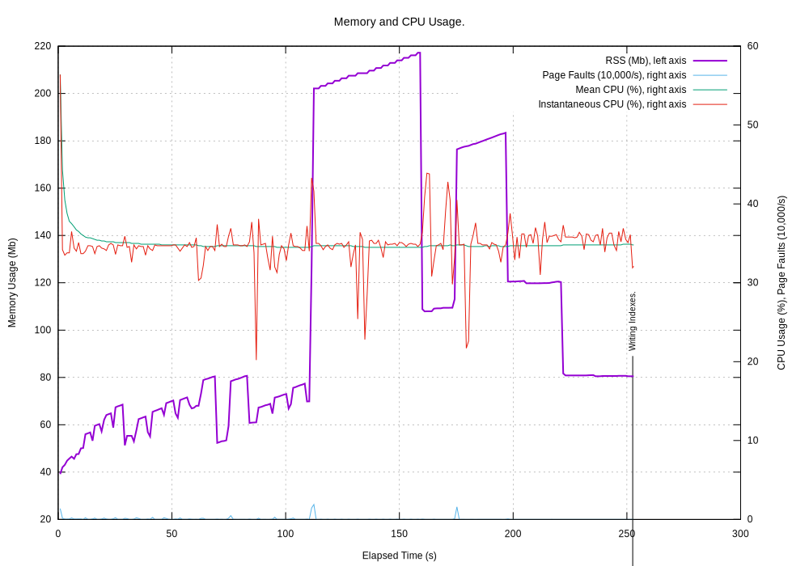
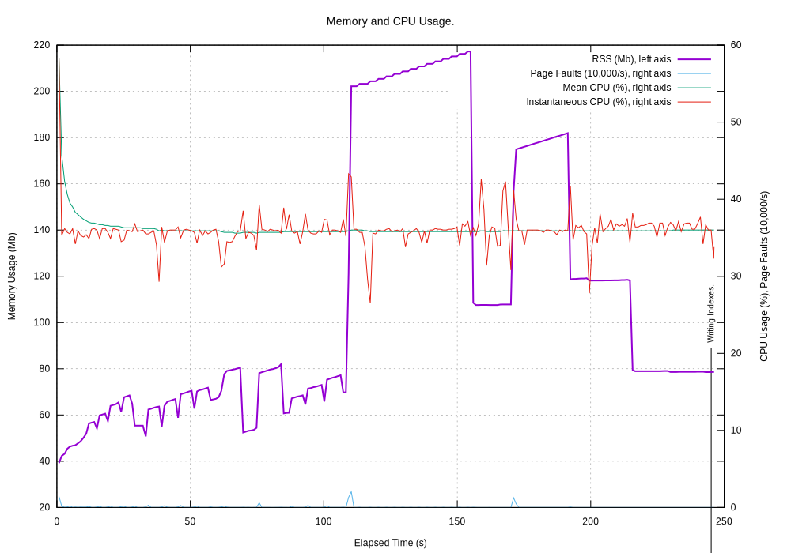

# Performance of cPyMemTrace

Source data: W005862 but with MDT folder removed.

There were 82 LAS files totalling 108,145,150 bytes. The largest file was 27,330,513 bytes, smallest 4,609 bytes.

## Memory Usage Monitored by `process.py`

`process.py` is a RSS monitor that runs in a seperate thread and reports the RSS at regular intervals.

### No use of cPyMemTrace

Output in `tmp/LAS/cPyMemTrace/LASToHtml_no_trace/LASToHTML.log`

`process.py` at 0.25s interval:

Processed 82 files and 108,145,150 bytes in 25.802 s, 250.2 ms/Mb

### cPyMemTrace No Events Computed, No Events Logged

This was to establish the overhead of calling `trace_or_profile_function()` but merely incrementing the event counter. Nothing is calculated. Nothing is logged.

Output in `tmp/LAS/cPyMemTrace/LASToHtml_trace_C/LASToHTML.log`. Time was 29.346 s, x1.137

`process.py` at 1.0s interval:

### cPyMemTrace RSS Only Computed, No Events Logged

This was to establish the overhead of calling `trace_or_profile_function()` as before but also computing just the RSS. Nothing is logged.

Output in `tmp/LAS/cPyMemTrace/LASToHtml_trace_D/LASToHTML.log`. Time was 241.212 s, x9.349

`process.py` at 1.0s interval, it is notable that the CPU is averaging around 35%:

### cPyMemTrace All Events Computed, No Events Logged

This was to establish the overhead of calling `trace_or_profile_function()` and extracting all the log file data but not actually logging any of it.

Output in `tmp/LAS/cPyMemTrace/LASToHtml_trace_B/LASToHTML.log`. Time was 252.640 s, x9.791

`process.py` at 1.0s interval:

### cPyMemTrace All Events Computed, RSS changes >=4096 bytes Logged

This was to establish the overhead of calling `trace_or_profile_function()` and extracting all the log file data but only logging them if the RSS changed by >=±4096 bytes (one page).

Output in `tmp/LAS/cPyMemTrace/LASToHtml_trace_E/LASToHTML.log`. Time was 246.278 s, x9.545

There were 138,243,077 events. The log file contained:

Lines: 74,518 (i.e. 1 in 1,855 events)
Words: 670,302
Bytes: 16,393,947

`process.py` at 1.0s interval:

### cPyMemTrace Every Event Computed and Logged

Output in `tmp/LAS/cPyMemTrace/LASToHtml_trace_A/LASToHTML.log`. Time was 576.656 s, x22.349

`process.py` at 1.0s interval:

Processed 82 files and 108,145,150 bytes in 576.656 s, 5591.3 ms/Mb

Log file contained 138,243,335 events.

Lines: 138,243,335
Words: 1,235,888,202
Bytes: 30,413,538,865

## Summary

Here are the overall times and the event rate for different configurations:

| Trace? | Calculate? | Log?          | Time (s) | ∆ Time (s) | Ratio   | Events/s |
| ------ | ---------- | ------------- | -------- | ---------- | ------- | -------- |
| No     | No         | No            | 25.8     |            | x1.0    | 5.4m     |
| Yes    | No         | No            | 29.4     | +3.6       | x1.14   | 4.7m     |
| Yes    | RSS        | No            | 241.2    | +211.8     | x9.35   | 0.57m    |
| Yes    | All        | No            | 252.6    | +11.4      | x9.79   | 0.55m    |
| Yes    | All        | RSS >= 4096   | 246.3    | -6.6       | x9.55   | 0.56m    |
| Yes    | All        | All           | 576.6    | +330.3     | x22.3   | 0.24m    |

### Cost of Tracing

For the 138,243,335 events (or 74,517 that are >= 4096) the run time can be used to calculate the the cost per event:

| Part of Tracing                  | Runtime cost in µs/event. |
| -------------------------------- | ------------------------- |
| Attach and call C trace function | 0.2                       |
| Calculate RSS                    | 1.5                       |
| Log an event                     | 2.5                       |

